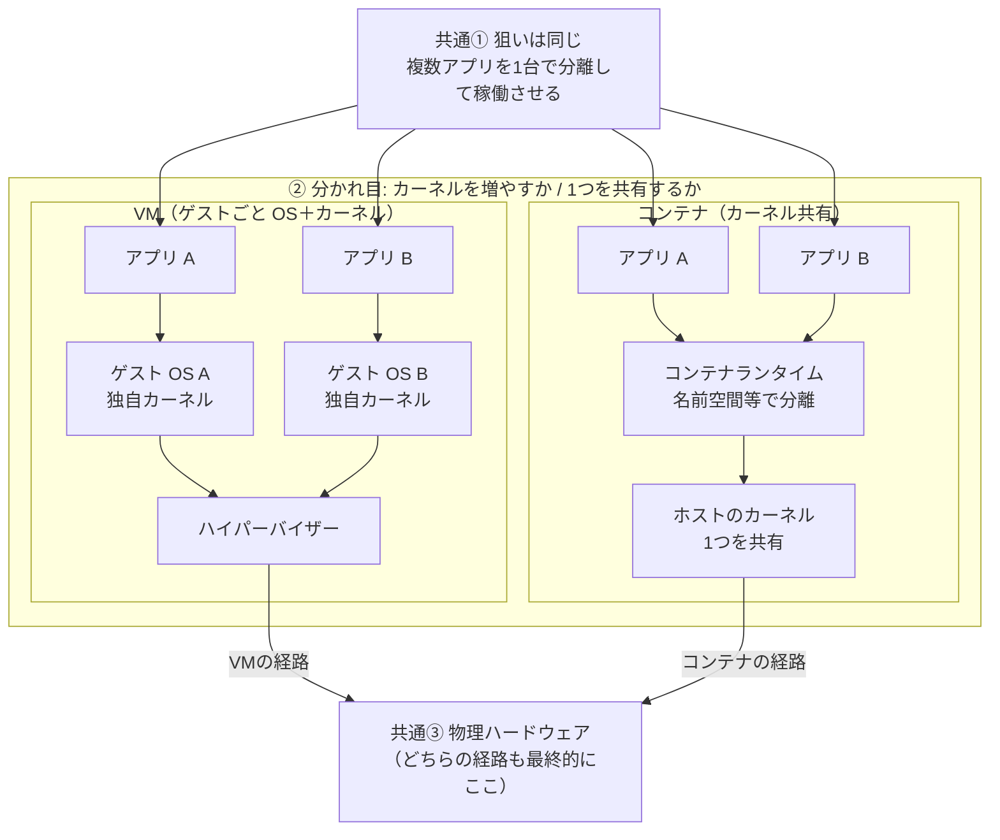
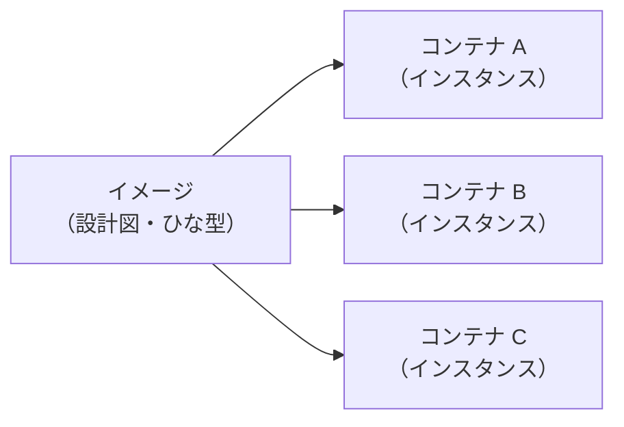

# 01. Dockerとは？

## この章で学ぶこと

- コンテナとは何か、仮想マシン（VM）と何が違うか
- イメージとコンテナの関係
- 基本コマンド: `docker run` / `docker ps` / `docker stop` / `docker rm`

所要時間の目安: **30〜45分**

---

## コンテナとは？

### 従来の問題

「自分のPCでは動くのに、本番サーバーでは動かない」

この問題の原因はほとんどの場合、**環境の差異**です。
- Python のバージョンが違う
- ライブラリのバージョンが違う
- OS の設定が違う

### コンテナが解決すること

コンテナは「アプリとその実行に必要なものをすべてまとめたパッケージ」です。
どのマシンでも同じ環境でアプリが動きます。

```
コンテナの中身:
  ├── アプリのコード
  ├── 必要なライブラリ
  ├── Python のバージョン
  └── OS の最低限の部分
```

### コンテナ vs 仮想マシン（VM）

| | コンテナ | 仮想マシン |
|---|---|---|
| 起動時間 | 秒単位 | 分単位 |
| サイズ | MB 単位 | GB 単位 |
| 分離レベル | プロセスと Linux 名前空間など（カーネルは共有） | ゲスト OS ごと（カーネルも別） |
| オーバーヘッド | 小さい | 大きい |

#### オーバーヘッドとは？

**オーバーヘッド**とは、「アプリを動かす」という本来の目的のほかに、仕組み側が余分に消費するコストのことです。たとえば **CPU・メモリ・ディスク容量** の追加消費、**起動にかかる時間**、**更新やパッチの対象になる OS の数** などが含まれます。VM はゲスト OS 全体を載せるためオーバーヘッドが大きく、コンテナはホストとカーネルを共有するため一般に小さくなります（ただし用途や設定によって変わります）。

#### 分離レベルの違い（図で比較）

**仮想マシン**は、ハイパーバイザーの上に **ゲスト OS（カーネル含む）が VM ごとに存在**します。アプリ同士は「別マシンに近い」強い分離になります。

**コンテナ**は、**ホスト OS のカーネルは 1 つを共有**し、アプリ側は **名前空間・cgroups など**でプロセスやファイル・ネットワークの見え方を分けます。VM より軽い一方、カーネルを共有するという意味では分離の境界が異なります。

**共通していること（先に押さえる）**

- **目的は同じく**、1 台のマシン上でアプリ A と B を**分離したまま**動かしたい、という点です（図では「共通①」）。
- **どちらの方式でも**、最終的に命令は **物理ハードウェア**で実行されます（図では「共通③」）。

**ここから先が違う（分かれ目）**

- **VM** はアプリごと（厳密には VM ごと）に **ゲスト OS とカーネルが増え**、その下に **ハイパーバイザー**が載ります。
- **コンテナ** は **カーネルは 1 つだけ**を使い、**コンテナランタイム**が名前空間などで「別の環境」のように見せます。

次の図は **上から下へ**読みます。中央の左右は「同時に両方使う」ではなく、**代表的な積み方を並べた比較**です。実運用ではどちらか（または混在構成）を選びます。



まとめると、コンテナは VM より **軽く・速く・イメージも小さくなりやすい**です。その代わり、分離の設計（カーネル共有）が VM と異なるため、脅威モデルやコンプライアンスの要件に応じて使い分けます。

---

## イメージとコンテナ

| 用語 | 説明 | 例え |
|---|---|---|
| **イメージ** | コンテナの設計図・テンプレート（まだ「この1つ」ではない） | クッキーの型 |
| **コンテナ** | イメージをもとに起動した**実行中の1単位**（= **インスタンス**） | 型から焼いたクッキー1枚 |

#### インスタンスとは？

**インスタンス**とは、ひな型や設計図から実際に作られた**具体的な1つ**のことです。Docker では **イメージがひな型**で、**コンテナはそのイメージのインスタンス**（＝同じ型から焼いたクッキーを1枚ずつ数えたときの「1枚」）に相当します。

プログラミングの言い方に寄せると、**クラス（イメージ）に対するオブジェクト（コンテナ）** に近いです。同じイメージから `docker run` を何度も実行すれば、**同じひな型のインスタンスが複数**動きます。それぞれは別のプロセス群・別のファイルシステムの見え方（書き込み層など）を持ちますが、元になったイメージの読み取り専用部分は共有されます。

下図は、**1つのイメージから複数のコンテナ（インスタンス）が生まれる**関係を示します。矢印は「このイメージをもとに起動できる」という意味です。



- 1つのイメージから複数のコンテナを起動できる
- イメージは変更できない（イミュータブル）
- コンテナはイメージをもとに起動・停止・削除できる

---

## ハンズオン: 基本コマンドを試す

Docker Desktop が起動していることを確認してから、ターミナルで以下を実行してください。

### 1. 最初のコンテナを起動する

```bash
docker run hello-world
```

「Hello from Docker!」と表示されれば成功です。これが一番シンプルなコンテナの実行です。

### 2. nginx（Web サーバー）を起動する

```bash
docker run -d -p 8080:80 --name my-nginx nginx
```

オプションの意味:
- `-d`: バックグラウンドで実行（デタッチモード）
- `-p 8080:80`: ホストの 8080 番ポートをコンテナの 80 番に繋げる
- `--name my-nginx`: コンテナに名前をつける

ブラウザで `http://localhost:8080` を開くと nginx の画面が表示されます。

### 3. 起動中のコンテナを確認する

```bash
docker ps
```

出力例:
```
CONTAINER ID   IMAGE   COMMAND                  CREATED         STATUS         PORTS                  NAMES
abc123def456   nginx   "/docker-entrypoint.…"   1 minute ago    Up 1 minute    0.0.0.0:8080->80/tcp   my-nginx
```

### 4. コンテナの中に入る

```bash
docker exec -it my-nginx bash
```

コンテナの中の Linux 環境に入れます。`exit` で出られます。

### 5. コンテナを停止する

```bash
docker stop my-nginx
```

### 6. 停止したコンテナも含めて一覧表示する

```bash
docker ps -a
```

### 7. コンテナを削除する

```bash
docker rm my-nginx
```

### 8. イメージの一覧を見る

```bash
docker images
```

### 9. イメージを削除する

```bash
docker rmi nginx
```

---

## コマンドまとめ

| コマンド | 説明 |
|---|---|
| `docker run <イメージ>` | イメージからコンテナを起動 |
| `docker ps` | 起動中のコンテナ一覧 |
| `docker ps -a` | 全コンテナ一覧（停止中含む） |
| `docker stop <名前>` | コンテナを停止 |
| `docker rm <名前>` | コンテナを削除 |
| `docker images` | イメージ一覧 |
| `docker rmi <イメージ>` | イメージを削除 |
| `docker exec -it <名前> bash` | コンテナの中に入る |
| `docker logs <名前>` | コンテナのログを見る |

---

## 演習

[exercises/](./exercises/) に課題があります。やってみましょう。
答えは [answers/](./answers/) で確認できます。

---

次の章: [02. Dockerfileの書き方](../02-dockerfile/README.md)
