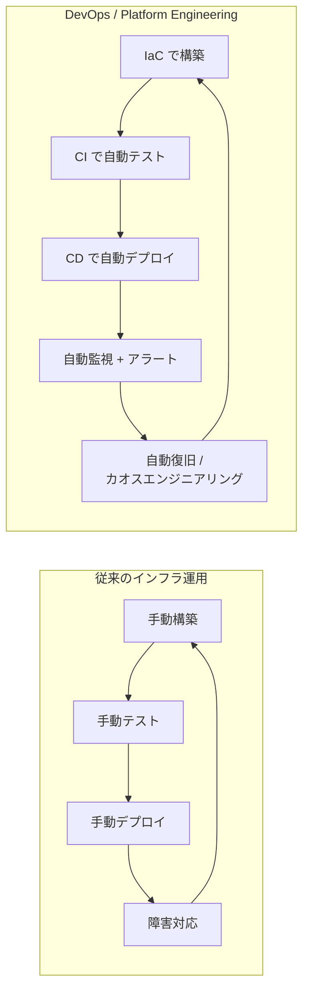
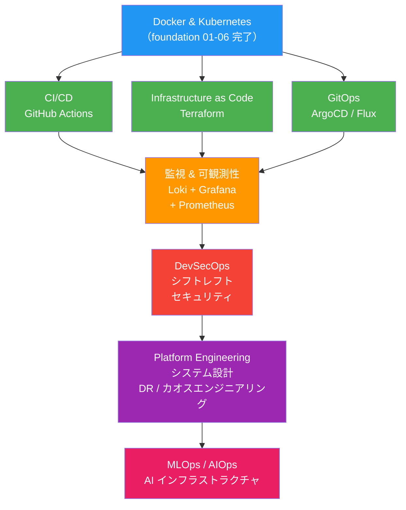
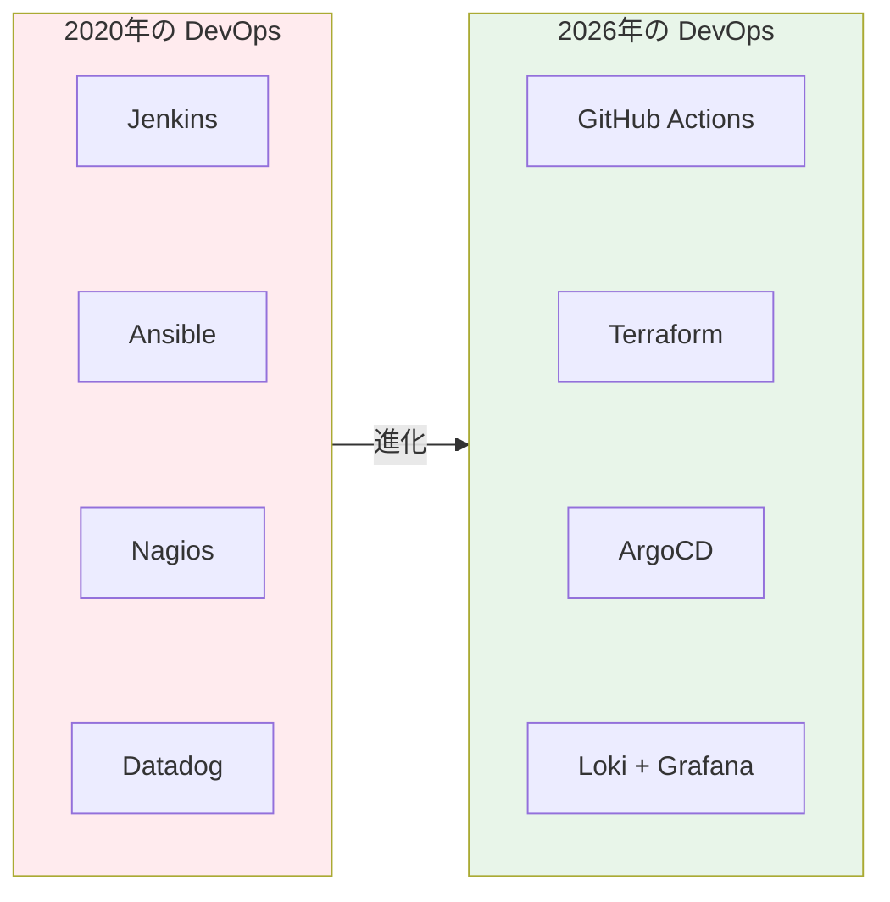
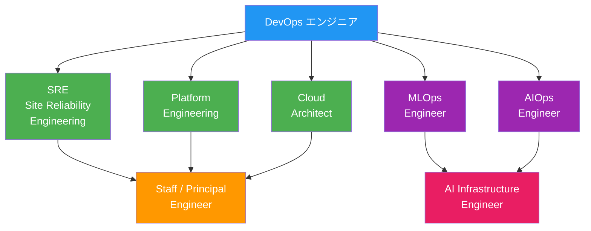

# DevOps ロードマップ 2026

Docker と Kubernetes の基礎を学んだあなたは、すでに DevOps の核となるコンテナ技術を習得しています。
このセクションでは、2026 年の現場で **実際に求められる DevOps スキルセット** を体系的に学びます。

---

## なぜ DevOps を学ぶのか

従来のインフラエンジニアの仕事は「サーバーを立てて維持する」ことでした。
しかし 2026 年の現場では、**コードを書く → テストする → デプロイする → 監視する → 改善する** というサイクル全体を自動化・高速化できるエンジニアが求められています。

---

## 2026 年版 DevOps スキルマップ

以下が、このリポジトリで学ぶ DevOps 技術の全体像です。

---

## 学習の進め方

### 推奨順序

| 順番 | 章 | 内容 | 前提 |
|:---:|-----|------|------|
| 1 | [08 - CI/CD](../08-ci-cd/) | GitHub Actions でパイプライン構築 | foundation 01-06 完了 |
| 2 | [09 - IaC (Terraform)](../09-iac-terraform/) | Terraform でインフラをコード管理 | 08 完了推奨 |
| 3 | [10 - GitOps](../10-gitops/) | ArgoCD でクラスタへの自動デプロイ | 08, 09 完了推奨 |
| 4 | [11 - 監視と可観測性](../11-monitoring-observability/) | Loki + Grafana + Prometheus | 10 完了推奨 |
| 5 | [12 - DevSecOps](../12-devsecops/) | セキュリティのシフトレフト | 08 完了推奨 |
| 6 | [13 - MLOps / AIOps](../13-mlops-aiops/) | AI 時代のインフラ運用 | 全章完了推奨 |

### 前提知識

- **必須**: Docker & Kubernetes の基礎（foundation 01-06 完了）
- **推奨**: Linux の基本操作、Git の基本操作、Python の基本文法

### 各章の学習時間の目安

各章には **概念説明 → ハンズオン → 演習問題** が含まれます。
1章あたり **2〜4時間** を目安にしてください。

---

## 技術選定の方針

このセクションの技術選定は、2026 年の求人市場と実務での採用実績に基づいています。

| カテゴリ | 選定技術 | 選定理由 |
|---------|---------|---------|
| CI/CD | **GitHub Actions** | リポジトリと統合、セキュリティスキャン内蔵、Jenkins からの移行が加速 |
| IaC | **Terraform** | マルチクラウド対応、一度覚えればどこでも使える、圧倒的なプロバイダ数 |
| GitOps | **ArgoCD** | K8s ネイティブ、UI あり、学習コスト低、Flux と並ぶデファクト |
| 監視 | **Loki + Grafana + Prometheus** | OSS でコスト最適、K8s との親和性、Datadog 比で柔軟性とコスト優位 |
| 言語 | **Python** | DevOps ツールの 99% が対応、AI/ML ツールの標準言語 |
| セキュリティ | **Trivy / Snyk / GitHub Advanced Security** | コンテナ・IaC・コード全方位スキャン |

---

## AI をフル活用せよ

2026 年の DevOps エンジニアにとって、**AI は必須のコアツール** です。

| 活用シーン | 具体例 |
|-----------|--------|
| **学習** | 概念の質問、エラーの解説、ベストプラクティスの確認 |
| **コーディング** | Terraform モジュール生成、GitHub Actions ワークフロー作成 |
| **トラブルシューティング** | ログ解析、K8s のイベント分析、パフォーマンスボトルネック特定 |
| **設計** | アーキテクチャレビュー、DR 計画の検証、コスト最適化 |

> AI を「ちょっと便利な検索エンジン」ではなく、**常に隣にいるシニアエンジニア**として使いこなすエンジニアが、他の全員を追い越す。

---

## この先のキャリアパス

---

## 次のステップ

準備ができたら [08 - CI/CD (GitHub Actions)](../08-ci-cd/) に進みましょう。
