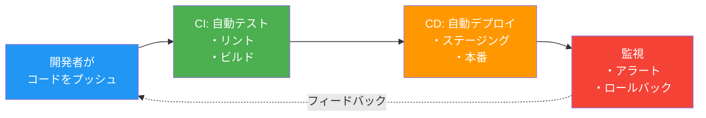
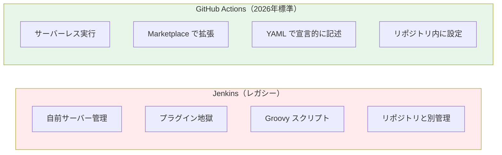
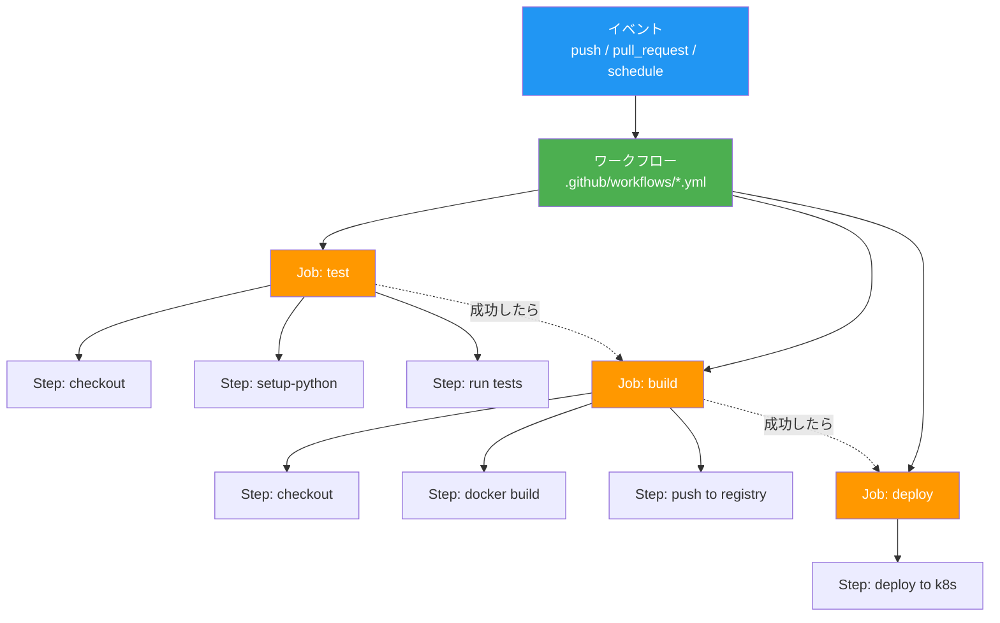
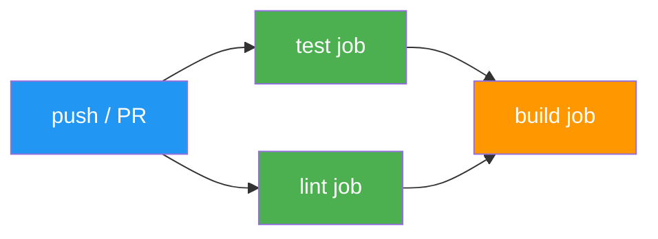
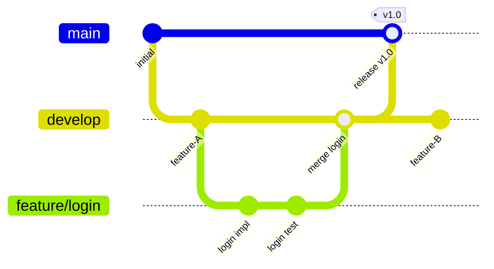

# CI/CD パイプライン — GitHub Actions

## この章で学ぶこと

- CI/CD の概念と「なぜ自動化するのか」
- GitHub Actions の基本アーキテクチャ
- ワークフローの書き方と実行
- テスト → ビルド → デプロイの自動化パイプライン構築
- ブランチ戦略と環境分離

---

## CI/CD とは

**CI（Continuous Integration）** は、コードの変更を頻繁にメインブランチに統合し、自動テストで品質を保証するプラクティスです。
**CD（Continuous Delivery / Deployment）** は、テストを通過したコードを自動的に本番環境にデプロイするプラクティスです。



### なぜ手動デプロイはダメなのか

| 手動デプロイ | CI/CD パイプライン |
|:------------|:------------------|
| 人によって手順が違う | 全員同じプロセス |
| 本番前のテスト忘れ | 自動テスト必須 |
| 深夜のデプロイ作業 | マージしたら自動反映 |
| ロールバックが怖い | ワンクリック / 自動ロールバック |
| 月1回のビッグリリース | 1日に何度でもリリース |

---

## なぜ GitHub Actions なのか



Jenkins はかつて CI/CD の王様でした。しかし 2026 年の現場では：

- **サーバー管理不要**: GitHub がランナーを提供
- **リポジトリと一体化**: `.github/workflows/` にワークフローを置くだけ
- **セキュリティスキャン内蔵**: Dependabot, CodeQL, Secret scanning
- **豊富なエコシステム**: Marketplace に 20,000 以上のアクション

---

## GitHub Actions の基本概念



### 用語の整理

| 用語 | 説明 |
|------|------|
| **Event** | ワークフローを起動するトリガー（push, PR, cron など） |
| **Workflow** | `.github/workflows/` 内の YAML ファイル |
| **Job** | ワークフロー内の独立した実行単位（並列 or 直列） |
| **Step** | Job 内の個別タスク（コマンド実行やアクション呼び出し） |
| **Runner** | ワークフローが実行される仮想マシン |
| **Action** | 再利用可能なステップ（Marketplace で公開） |

---

## ハンズオン：最初のワークフロー

### Step 1: ワークフローファイルの作成

以下の内容で `.github/workflows/ci.yml` を作成します。

```yaml
name: CI Pipeline

on:
  push:
    branches: [main]
  pull_request:
    branches: [main]

jobs:
  test:
    runs-on: ubuntu-latest
    steps:
      - uses: actions/checkout@v4

      - name: Set up Python
        uses: actions/setup-python@v5
        with:
          python-version: "3.12"

      - name: Install dependencies
        run: |
          pip install -r application/webapp/phase1-local/requirements.txt
          pip install pytest

      - name: Run tests
        run: pytest tests/ -v

  lint:
    runs-on: ubuntu-latest
    steps:
      - uses: actions/checkout@v4

      - name: Set up Python
        uses: actions/setup-python@v5
        with:
          python-version: "3.12"

      - name: Install linter
        run: pip install ruff

      - name: Run linter
        run: ruff check .

  build:
    needs: [test, lint]
    runs-on: ubuntu-latest
    steps:
      - uses: actions/checkout@v4

      - name: Build Docker image
        run: |
          docker build -t todo-app:${{ github.sha }} \
            application/webapp/phase2-docker/

      - name: Verify image
        run: docker images todo-app
```

### Step 2: ワークフローの構造を理解する



- `test` と `lint` は **並列実行**（互いに依存しない）
- `build` は `needs: [test, lint]` で **両方の成功後** に実行

### Step 3: 高度なワークフロー要素

#### マトリクスビルド

複数のバージョンやOSでテストを並列実行できます。

```yaml
jobs:
  test:
    strategy:
      matrix:
        python-version: ["3.11", "3.12", "3.13"]
        os: [ubuntu-latest, macos-latest]
    runs-on: ${{ matrix.os }}
    steps:
      - uses: actions/checkout@v4
      - uses: actions/setup-python@v5
        with:
          python-version: ${{ matrix.python-version }}
      - run: pytest tests/ -v
```

#### シークレットの利用

```yaml
steps:
  - name: Login to Container Registry
    run: |
      echo "${{ secrets.REGISTRY_PASSWORD }}" | \
        docker login -u "${{ secrets.REGISTRY_USERNAME }}" --password-stdin
```

#### 環境（Environments）による保護

```yaml
jobs:
  deploy-staging:
    environment: staging
    # ...

  deploy-production:
    needs: deploy-staging
    environment:
      name: production
      url: https://myapp.example.com
    # 手動承認が必要
```

---

## ブランチ戦略



| 戦略 | 説明 | 適用場面 |
|------|------|---------|
| **GitHub Flow** | main + feature ブランチ | 小規模チーム、頻繁なデプロイ |
| **Git Flow** | main + develop + feature + release | 大規模、リリースサイクルが長い |
| **Trunk-Based** | main に直接コミット | CI/CD が成熟したチーム |

---

## よく使う GitHub Actions

| アクション | 用途 |
|-----------|------|
| `actions/checkout@v4` | リポジトリのチェックアウト |
| `actions/setup-python@v5` | Python 環境のセットアップ |
| `docker/build-push-action@v6` | Docker イメージのビルドとプッシュ |
| `github/codeql-action@v3` | コードのセキュリティスキャン |
| `actions/cache@v4` | 依存関係のキャッシュ |

---

## ベストプラクティス

1. **ワークフローはできるだけ速く**: キャッシュを活用、不要なステップを削除
2. **シークレットはハードコードしない**: `${{ secrets.XXX }}` を使う
3. **再利用可能なワークフロー**: `workflow_call` で共通処理を切り出す
4. **ブランチ保護**: main への直接プッシュを禁止、PR 必須
5. **失敗時の通知**: Slack 連携やメール通知を設定

---

## 演習問題

[exercises/](./exercises/) ディレクトリに演習があります。

---

## 次のステップ

CI/CD パイプラインを構築できたら、次は [09 - Infrastructure as Code (Terraform)](../09-iac-terraform/) でインフラ自体をコード化する方法を学びます。
