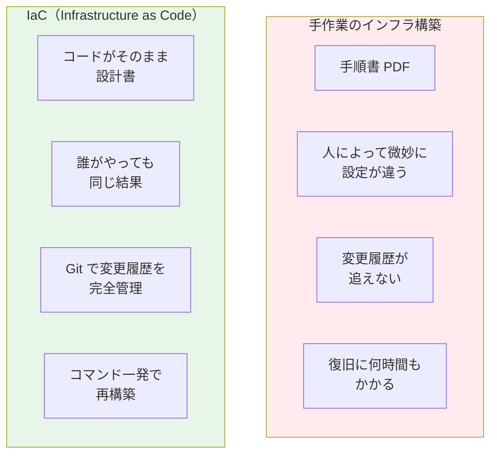
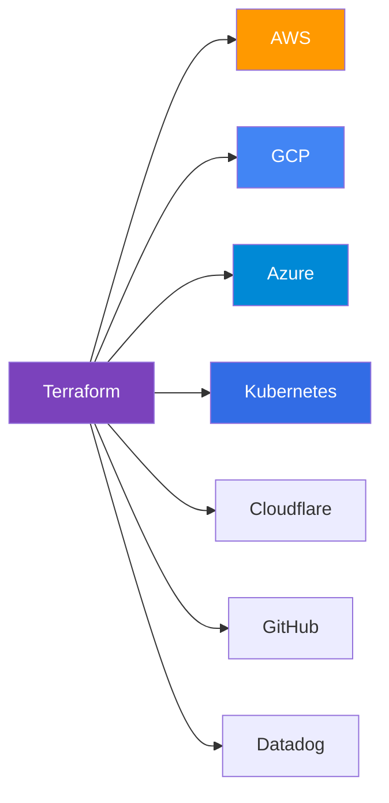
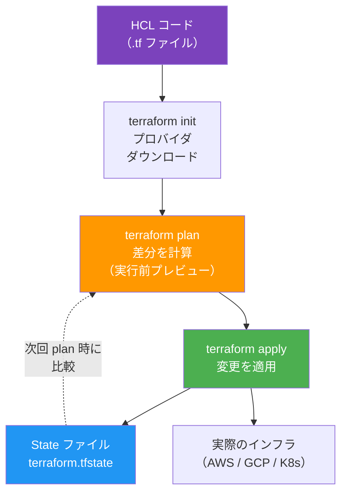
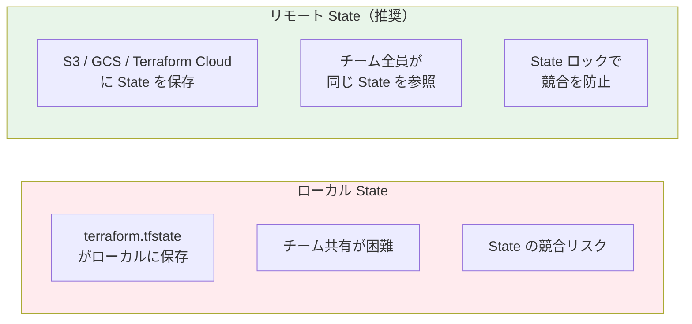

# Infrastructure as Code — Terraform

## この章で学ぶこと

- Infrastructure as Code（IaC）の概念と必要性
- Terraform の基本アーキテクチャ
- HCL（HashiCorp Configuration Language）の書き方
- リソースの作成・変更・削除のライフサイクル
- State 管理とモジュール化

---

## なぜインフラをコード化するのか

手作業でサーバーやネットワークを構築すると、以下の問題が起きます。



### IaC の 3 つの原則

| 原則 | 説明 |
|------|------|
| **冪等性（Idempotency）** | 何回実行しても同じ結果になる |
| **宣言的記述** | 「こうなってほしい」を書く（手順ではない） |
| **バージョン管理** | Git でインフラの変更履歴を追跡できる |

---

## なぜ Terraform なのか



Terraform が選ばれる理由：

- **マルチクラウド対応**: AWS, GCP, Azure すべてに同じ言語で対応
- **3,000 以上のプロバイダ**: クラウドだけでなく SaaS も管理可能
- **宣言的**: 「あるべき状態」を書くだけで差分を自動計算
- **Plan → Apply**: 変更を事前確認してから適用
- **State 管理**: 現在のインフラ状態を正確に把握

> Ansible は構成管理ツールとして長く使われてきましたが、2026 年の IaC は Terraform + GitOps + ArgoCD が標準です。Ansible は既存環境の設定変更には依然有用ですが、新規構築なら Terraform を第一選択にしましょう。

---

## Terraform の仕組み



### コアワークフロー

```
terraform init    → プロバイダのダウンロード、バックエンドの初期化
terraform plan    → 現在の状態と設定の差分を表示（ドライラン）
terraform apply   → 変更を実際に適用
terraform destroy → リソースの削除
```

---

## HCL の基本構文

### プロバイダ設定

```hcl
terraform {
  required_version = ">= 1.9.0"

  required_providers {
    aws = {
      source  = "hashicorp/aws"
      version = "~> 5.0"
    }
  }
}

provider "aws" {
  region = "ap-northeast-1"
}
```

### リソース定義

```hcl
resource "aws_instance" "web" {
  ami           = "ami-0abcdef1234567890"
  instance_type = "t3.micro"

  tags = {
    Name        = "web-server"
    Environment = "production"
  }
}
```

### 変数

```hcl
variable "instance_type" {
  description = "EC2 インスタンスタイプ"
  type        = string
  default     = "t3.micro"
}

resource "aws_instance" "web" {
  instance_type = var.instance_type
}
```

### 出力

```hcl
output "instance_ip" {
  description = "Web サーバーのパブリック IP"
  value       = aws_instance.web.public_ip
}
```

---

## ハンズオン：Docker プロバイダで学ぶ Terraform

実際のクラウドアカウントがなくても、Docker プロバイダを使ってローカルで Terraform を学べます。

### Step 1: Terraform のインストール

```bash
brew install terraform
terraform version
```

### Step 2: プロジェクトの作成

```bash
mkdir terraform-demo && cd terraform-demo
```

`main.tf` を作成：

```hcl
terraform {
  required_providers {
    docker = {
      source  = "kreuzwerker/docker"
      version = "~> 3.0"
    }
  }
}

provider "docker" {}

resource "docker_image" "nginx" {
  name         = "nginx:latest"
  keep_locally = false
}

resource "docker_container" "nginx" {
  image = docker_image.nginx.image_id
  name  = "terraform-nginx"

  ports {
    internal = 80
    external = 8080
  }
}

output "container_id" {
  value = docker_container.nginx.id
}

output "nginx_url" {
  value = "http://localhost:8080"
}
```

### Step 3: 実行

```bash
terraform init     # プロバイダをダウンロード
terraform plan     # 何が作成されるか確認
terraform apply    # 実際に作成（yes で確認）
curl localhost:8080 # nginx のレスポンスを確認
terraform destroy  # クリーンアップ
```

---

## State 管理

### ローカル State vs リモート State



### リモートバックエンドの設定例

```hcl
terraform {
  backend "s3" {
    bucket         = "my-terraform-state"
    key            = "prod/terraform.tfstate"
    region         = "ap-northeast-1"
    dynamodb_table = "terraform-lock"
    encrypt        = true
  }
}
```

---

## モジュール化

大規模なインフラはモジュールに分割して管理します。

```
modules/
├── vpc/
│   ├── main.tf
│   ├── variables.tf
│   └── outputs.tf
├── eks/
│   ├── main.tf
│   ├── variables.tf
│   └── outputs.tf
└── rds/
    ├── main.tf
    ├── variables.tf
    └── outputs.tf
```

```hcl
module "vpc" {
  source = "./modules/vpc"

  cidr_block = "10.0.0.0/16"
  name       = "production"
}

module "eks" {
  source = "./modules/eks"

  vpc_id     = module.vpc.vpc_id
  subnet_ids = module.vpc.private_subnet_ids
}
```

---

## ベストプラクティス

1. **State をリモートに保存**: S3 + DynamoDB（ロック用）が定番
2. **環境をディレクトリで分離**: `environments/dev/`, `environments/prod/`
3. **モジュールで再利用**: 共通インフラをモジュール化
4. **`terraform plan` を PR に表示**: GitHub Actions で自動化
5. **Sensitive データは `sensitive = true`**: State への平文保存を防ぐ
6. **バージョン固定**: プロバイダとTerraform本体のバージョンを固定

---

## 演習問題

[exercises/](./exercises/) ディレクトリに演習があります。

---

## 次のステップ

Terraform でインフラをコード化できたら、次は [10 - GitOps (ArgoCD)](../10-gitops/) で、Kubernetes クラスタへの自動同期を学びます。
