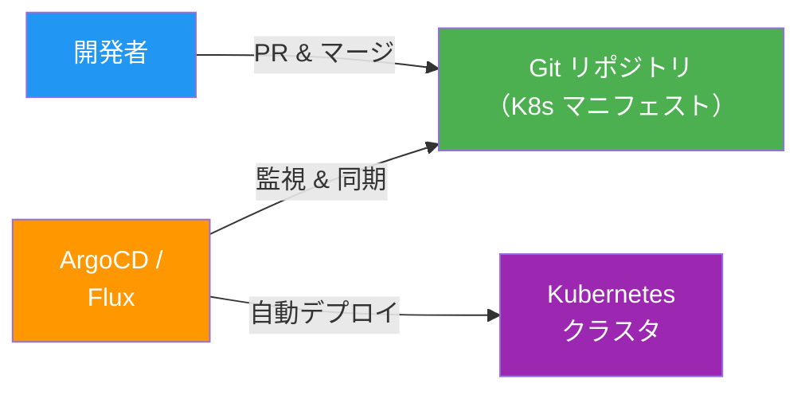
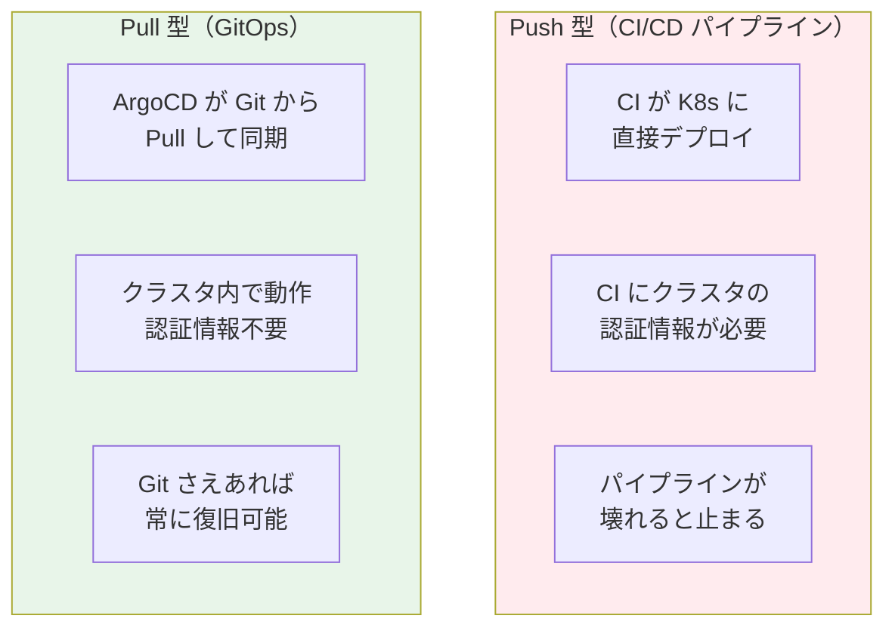
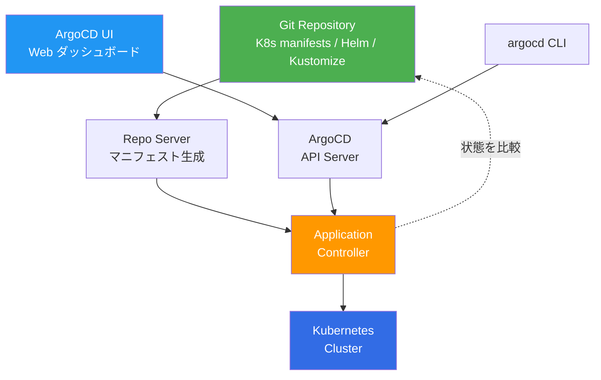
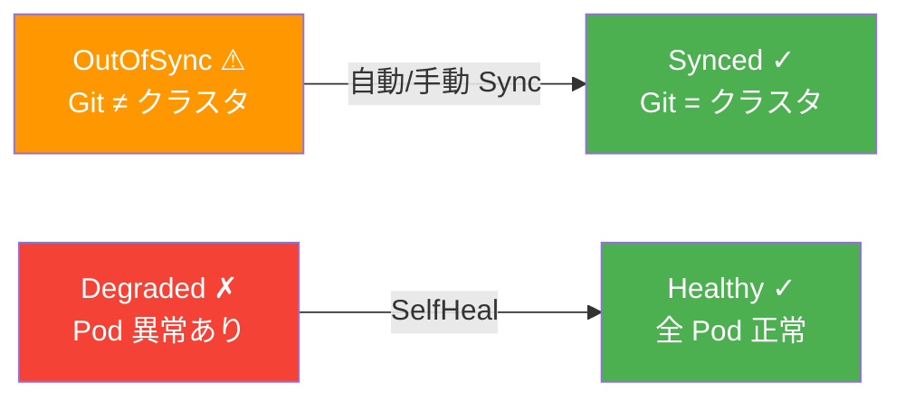

# GitOps — ArgoCD / Flux

## この章で学ぶこと

- GitOps の概念と「なぜ手動デプロイが終わったのか」
- ArgoCD のアーキテクチャと基本操作
- Git リポジトリからの自動同期（Sync）
- Application の定義とヘルスチェック
- Flux との比較

---

## GitOps とは

**GitOps** は、**Git リポジトリを唯一の信頼源（Single Source of Truth）** として、インフラとアプリケーションの状態を管理する手法です。



### GitOps の 4 原則

| # | 原則 | 説明 |
|---|------|------|
| 1 | **宣言的** | システムの「あるべき状態」を宣言的に記述する |
| 2 | **バージョン管理** | すべての状態が Git で管理される |
| 3 | **自動適用** | 承認された変更が自動的にシステムに適用される |
| 4 | **自動修復** | 実際の状態が宣言と異なる場合、自動的に修復される |

### Push 型 vs Pull 型デプロイ



GitOps は **Pull 型** を採用しています。ArgoCD がクラスタ内から Git を監視し、変更を検知して自動同期するため、CI に強力な権限を渡す必要がありません。

---

## ArgoCD のアーキテクチャ



| コンポーネント | 役割 |
|--------------|------|
| **API Server** | UI / CLI からのリクエストを処理 |
| **Repo Server** | Git からマニフェストを取得・生成 |
| **Application Controller** | クラスタの状態と Git の状態を比較・同期 |

---

## ハンズオン：kind + ArgoCD

### Step 1: ArgoCD のインストール

```bash
# kind クラスタが起動していることを確認
kubectl cluster-info

# ArgoCD の namespace を作成してインストール
kubectl create namespace argocd
kubectl apply -n argocd -f https://raw.githubusercontent.com/argoproj/argo-cd/stable/manifests/install.yaml

# Pod が起動するまで待つ
kubectl wait --for=condition=Ready pods --all -n argocd --timeout=300s
```

### Step 2: ArgoCD UI にアクセス

```bash
# 初期パスワードを取得
kubectl -n argocd get secret argocd-initial-admin-secret \
  -o jsonpath="{.data.password}" | base64 -d; echo

# ポートフォワードで UI にアクセス
kubectl port-forward svc/argocd-server -n argocd 8080:443
```

ブラウザで `https://localhost:8080` にアクセスし、ユーザー名 `admin` と取得したパスワードでログイン。

### Step 3: Application の定義

`argocd-app.yaml`:

```yaml
apiVersion: argoproj.io/v1alpha1
kind: Application
metadata:
  name: todo-app
  namespace: argocd
spec:
  project: default
  source:
    repoURL: https://github.com/YOUR_USER/YOUR_REPO.git
    targetRevision: main
    path: application/webapp/phase4-k8s/k8s
  destination:
    server: https://kubernetes.default.svc
    namespace: default
  syncPolicy:
    automated:
      prune: true
      selfHeal: true
    syncOptions:
      - CreateNamespace=true
```

```bash
kubectl apply -f argocd-app.yaml
```

### Step 4: 同期の確認



---

## ArgoCD vs Flux

| 観点 | ArgoCD | Flux |
|------|--------|------|
| **UI** | リッチな Web UI あり | CLI 中心（Weave GitOps で UI 追加可） |
| **マルチクラスタ** | 標準で対応 | 各クラスタに個別インストール |
| **学習コスト** | UI があるため入門しやすい | K8s ネイティブだが UI がない |
| **マニフェスト管理** | Helm / Kustomize / plain YAML | Helm / Kustomize / plain YAML |
| **コミュニティ** | CNCF Graduated | CNCF Graduated |

どちらも CNCF の Graduated プロジェクトで成熟しています。本教材では **UI の学習しやすさ** から ArgoCD を推奨しますが、Flux も同等の能力を持ちます。

---

## ベストプラクティス

1. **アプリコードとマニフェストのリポジトリを分離**: 変更頻度が異なるため
2. **自動 Sync + SelfHeal を有効化**: 手動 Sync は本番で忘れるリスクがある
3. **Sync Wave で順序制御**: DB → API → Frontend の順にデプロイ
4. **Notification で通知**: Slack / Teams に同期結果を通知
5. **RBAC で権限制御**: 本番環境の Sync は承認者のみ

---

## 演習問題

[exercises/](./exercises/) ディレクトリに演習があります。

---

## 次のステップ

GitOps でデプロイを自動化できたら、次は [11 - 監視と可観測性](../11-monitoring-observability/) で、運用中のシステムを「見える化」する方法を学びます。
