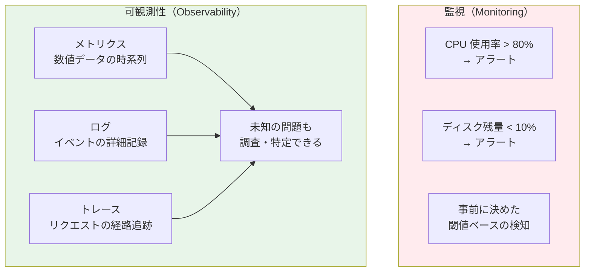
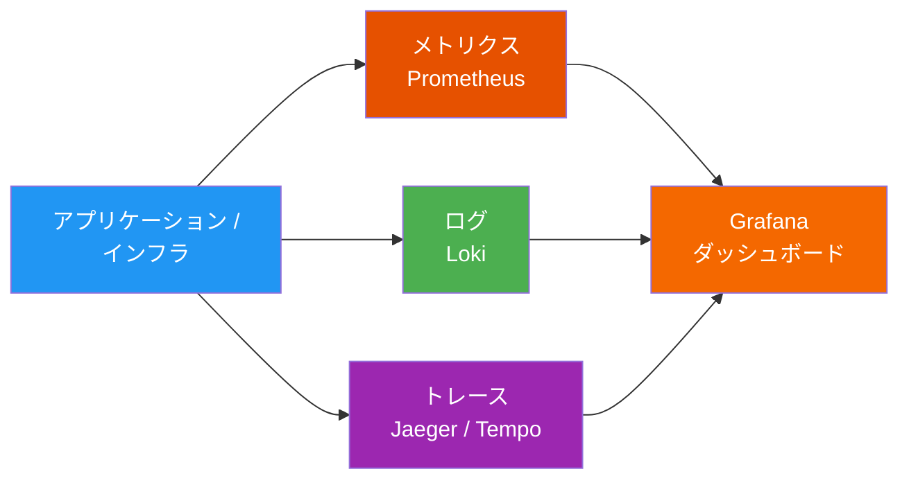
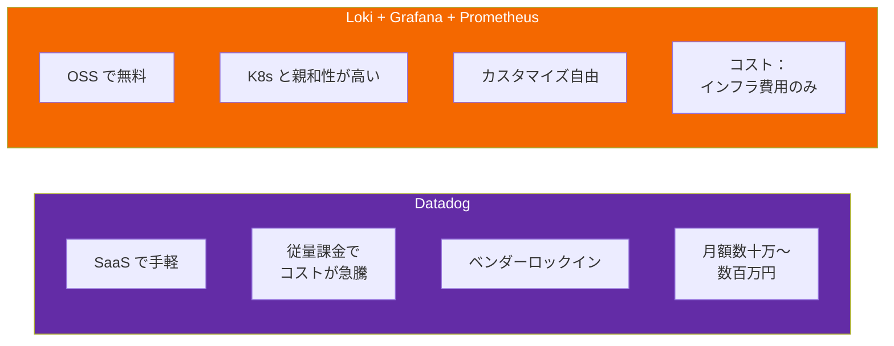
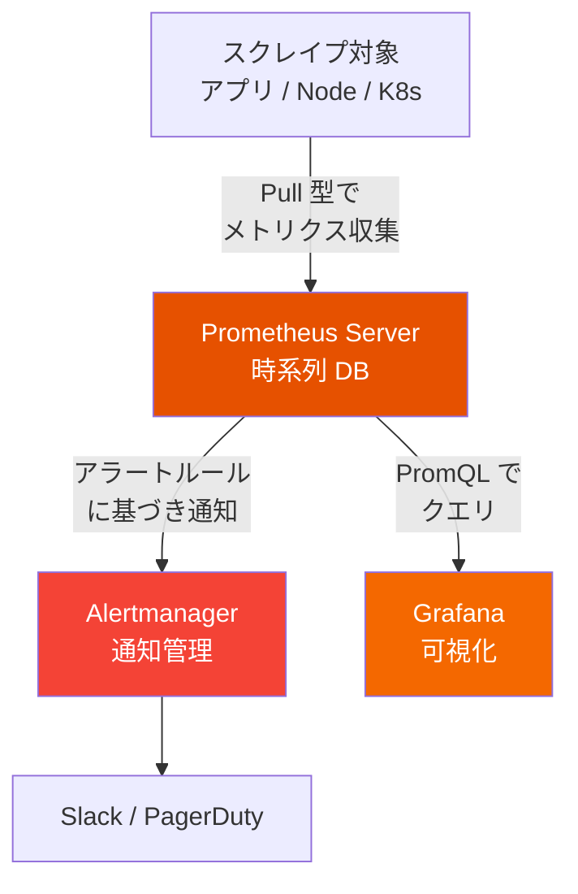
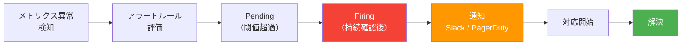

# 監視と可観測性 — Prometheus + Grafana + Loki

## この章で学ぶこと

- 監視（Monitoring）と可観測性（Observability）の違い
- 可観測性の 3 本柱：メトリクス・ログ・トレース
- Prometheus でメトリクス収集
- Loki でログ集約
- Grafana でダッシュボード可視化
- なぜ Datadog ではなく Loki + Grafana なのか

---

## 監視 vs 可観測性



> **監視** は「既知の問題を検知する」仕組み。**可観測性** は「未知の問題も調査・特定できる」能力。

---

## 可観測性の 3 本柱



| 柱 | ツール | データ例 |
|----|--------|---------|
| **メトリクス** | Prometheus | CPU 使用率、リクエスト数、レイテンシ、エラー率 |
| **ログ** | Loki | アプリのエラーログ、アクセスログ、K8s イベント |
| **トレース** | Jaeger / Tempo | マイクロサービス間のリクエスト経路と所要時間 |

---

## なぜ Loki + Grafana なのか（vs Datadog）



| 比較軸 | Datadog | Loki + Grafana |
|--------|---------|---------------|
| **コスト** | ホスト数・ログ量で従量課金（予算破壊リスク） | OSS、インフラ費用のみ |
| **K8s 連携** | エージェント追加が必要 | Helm チャートで即導入 |
| **カスタマイズ** | SaaS の範囲内 | 完全にカスタマイズ可能 |
| **学習価値** | 操作を覚えるだけ | 監視の仕組みそのものを理解できる |
| **ベンダーロック** | あり | なし |

> Datadog は優れた SaaS ですが、K8s 環境では Loki + Grafana + Prometheus の組み合わせが **柔軟性・コスト・学習価値** の全てで優位です。

---

## Prometheus の基本

### アーキテクチャ



### PromQL の基本

```promql
# 直近5分のHTTPリクエスト数（毎秒）
rate(http_requests_total[5m])

# エラー率
rate(http_requests_total{status=~"5.."}[5m])
/ rate(http_requests_total[5m])

# P99 レイテンシ
histogram_quantile(0.99, rate(http_request_duration_seconds_bucket[5m]))
```

### 4 つのゴールデンシグナル（Google SRE）

| シグナル | 説明 | PromQL 例 |
|---------|------|-----------|
| **レイテンシ** | リクエストの応答時間 | `histogram_quantile(0.99, ...)` |
| **トラフィック** | リクエスト量 | `rate(http_requests_total[5m])` |
| **エラー** | 失敗したリクエストの割合 | `rate(http_requests_total{status="500"}[5m])` |
| **サチュレーション** | リソースの飽和度 | `node_memory_MemAvailable_bytes / node_memory_MemTotal_bytes` |

---

## Loki の基本

### Loki vs Elasticsearch

| 比較軸 | Loki | Elasticsearch (ELK) |
|--------|------|---------------------|
| **インデックス** | ラベルのみ（軽量） | 全文インデックス（重い） |
| **リソース消費** | 低い | 高い（JVM ヒープ） |
| **K8s 連携** | Pod ラベルを自動取得 | 設定が複雑 |
| **コスト** | 圧倒的に安い | ストレージ・CPU 大量消費 |

### LogQL の基本

```logql
# 特定の namespace のエラーログ
{namespace="production"} |= "error"

# JSON ログのパース
{app="todo-api"} | json | status >= 500

# 直近1時間のエラー数
count_over_time({namespace="production"} |= "error" [1h])
```

---

## ハンズオン：kind クラスタで監視スタック構築

### Step 1: Helm のインストール

```bash
brew install helm
```

### Step 2: kube-prometheus-stack のインストール

```bash
helm repo add prometheus-community https://prometheus-community.github.io/helm-charts
helm repo update

helm install monitoring prometheus-community/kube-prometheus-stack \
  --namespace monitoring \
  --create-namespace \
  --set grafana.adminPassword=admin
```

### Step 3: Loki のインストール

```bash
helm repo add grafana https://grafana.github.io/helm-charts

helm install loki grafana/loki-stack \
  --namespace monitoring \
  --set promtail.enabled=true \
  --set loki.persistence.enabled=false
```

### Step 4: Grafana にアクセス

```bash
kubectl port-forward svc/monitoring-grafana -n monitoring 3000:80
```

ブラウザで `http://localhost:3000` にアクセス。ユーザー名 `admin`、パスワード `admin` でログイン。

### Step 5: ダッシュボード確認

1. 左メニューの **Dashboards** → **Browse** から組み込みダッシュボードを確認
2. 「Kubernetes / Compute Resources / Cluster」で CPU / メモリの全体像を確認
3. 「Kubernetes / Compute Resources / Pod」で Pod 単位のリソースを確認

---

## アラート設計



### アラートルールの例

```yaml
groups:
  - name: app-alerts
    rules:
      - alert: HighErrorRate
        expr: |
          rate(http_requests_total{status=~"5.."}[5m])
          / rate(http_requests_total[5m]) > 0.05
        for: 5m
        labels:
          severity: critical
        annotations:
          summary: "エラー率が 5% を超えています"

      - alert: HighLatency
        expr: |
          histogram_quantile(0.99,
            rate(http_request_duration_seconds_bucket[5m])
          ) > 1
        for: 5m
        labels:
          severity: warning
        annotations:
          summary: "P99 レイテンシが 1 秒を超えています"
```

---

## ベストプラクティス

1. **ゴールデンシグナルを最初に監視**: レイテンシ・トラフィック・エラー・サチュレーション
2. **アラート疲れを避ける**: 本当にアクションが必要なものだけ通知
3. **ダッシュボードは目的別に分ける**: 概要 / サービス別 / インフラ別
4. **ログにはラベルを適切に付与**: K8s の namespace / app / pod 名
5. **保持期間を設計**: メトリクスは 15 日〜90 日、ログは 7 日〜30 日が一般的

---

## 演習問題

[exercises/](./exercises/) ディレクトリに演習があります。

---

## 次のステップ

監視と可観測性を整えたら、次は [12 - DevSecOps](../12-devsecops/) で、セキュリティをパイプラインに組み込む方法を学びます。
