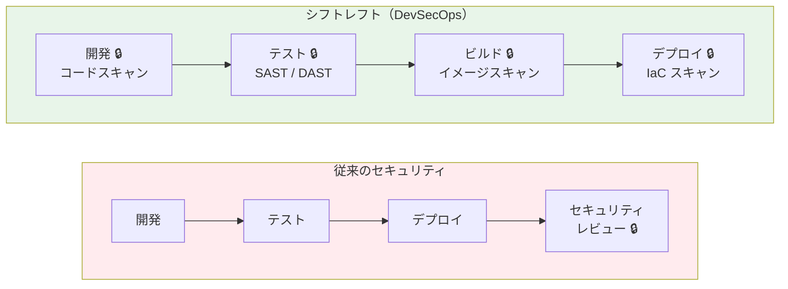
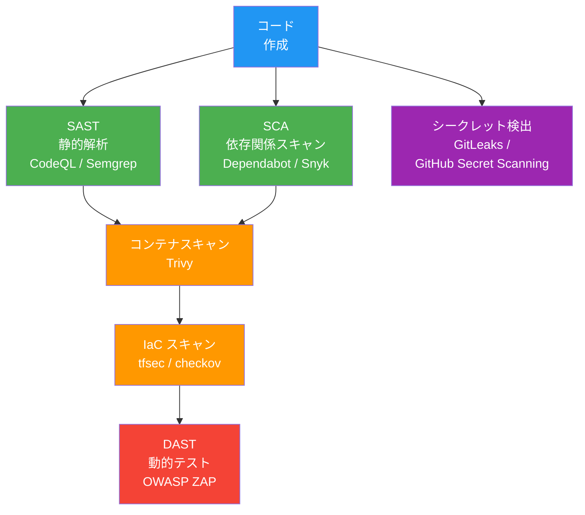
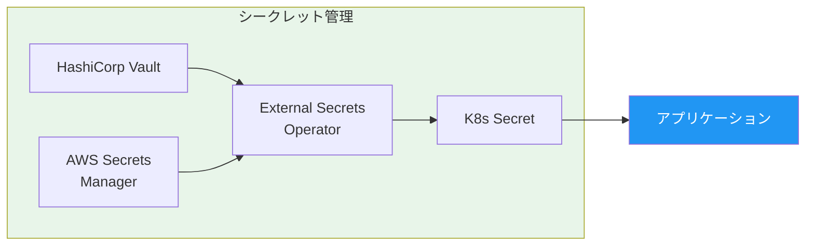
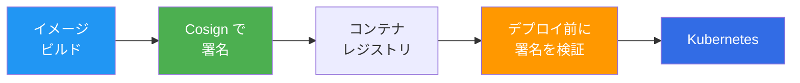

# 12. DevSecOps — セキュリティのシフトレフト

> ⏱ 所要時間目安: 2〜3 時間
>
> **本章の構成**: 必須（コンテナスキャン + シークレット管理）→ 推奨（IaC スキャン）→ 発展（Supply Chain Security）の順に学びます。

## この章で学ぶこと

- DevSecOps の概念と「シフトレフト」の意味
- セキュリティスキャンの種類と適用タイミング
- コンテナイメージスキャン（Trivy）
- IaC スキャン（tfsec / checkov）
- 依存関係スキャン（Dependabot / Snyk）
- GitHub Advanced Security の活用
- シークレット管理のベストプラクティス

---

## シフトレフトとは

従来のセキュリティは **開発の最後** に行われていました。DevSecOps では **開発の最初から** セキュリティを組み込みます。



> **セキュリティは「セキュリティチームの仕事」ではない。** 2026 年の DevOps エンジニアは、コード・コンテナ・IaC のすべてを本番に出す前にスキャンする責任がある。

---

## セキュリティスキャンの全体像



| スキャン種類 | タイミング | ツール例 | 検出対象 |
|------------|----------|---------|---------|
| **SAST** | コーディング時 | CodeQL, Semgrep | SQLインジェクション、XSS、バッファオーバーフロー |
| **SCA** | ビルド時 | Dependabot, Snyk | 脆弱な依存ライブラリ |
| **コンテナスキャン** | イメージビルド後 | Trivy, Grype | OS パッケージの脆弱性、設定ミス |
| **IaC スキャン** | Plan 前 | tfsec, checkov | セキュリティグループの過剰公開、暗号化の欠如 |
| **DAST** | デプロイ後 | OWASP ZAP | 実行時の脆弱性 |
| **シークレット検出** | コミット時 | Gitleaks, GitHub | ハードコードされたパスワード・API キー |

---

## ハンズオン：Trivy でコンテナスキャン

### Step 1: Trivy のインストール

```bash
brew install trivy
```

### Step 2: イメージスキャン

```bash
# phase2-docker のイメージをビルド
cd application/webapp/phase2-docker
docker build -t todo-app:scan .

# Trivy でスキャン
trivy image todo-app:scan
```

出力例：

```
todo-app:scan (debian 12.5)
=============================
Total: 42 (UNKNOWN: 0, LOW: 20, MEDIUM: 15, HIGH: 5, CRITICAL: 2)
```

### Step 3: 重大な脆弱性のみフィルタ

```bash
trivy image --severity HIGH,CRITICAL todo-app:scan
```

### Step 4: CI に組み込む

```yaml
# .github/workflows/security.yml
name: Security Scan

on: [push, pull_request]

jobs:
  trivy:
    runs-on: ubuntu-latest
    steps:
      - uses: actions/checkout@v4

      - name: Build image
        run: docker build -t todo-app:${{ github.sha }} application/webapp/phase2-docker/

      - name: Run Trivy
        uses: aquasecurity/trivy-action@0.28.0  # バージョンを固定（@master は使わない）
        with:
          image-ref: todo-app:${{ github.sha }}
          severity: HIGH,CRITICAL
          exit-code: 1
```

---

## 推奨: IaC スキャン

> Terraform は [09 章](../09-iac-terraform/) を修了していることが前提です。

### Trivy で Terraform / K8s マニフェストをスキャン

> `tfsec` は Trivy に統合・移行されました。2026 年現在は `trivy config` を使います。

```bash
# Terraform ディレクトリをスキャン
trivy config .

# Kubernetes マニフェストをスキャン
trivy config application/webapp/phase4-k8s/k8s/

# Dockerfile をスキャン
trivy config --file-patterns "dockerfile:Dockerfile" .
```

検出例：

```
Failures: 3 (HIGH: 2, CRITICAL: 1)
  - Security group allows ingress from 0.0.0.0/0 to port 22
  - Container running as root
```

### checkov で幅広い IaC をスキャン（代替ツール）

```bash
pip install checkov

# Terraform
checkov -d .

# Kubernetes マニフェスト
checkov -d application/webapp/phase4-k8s/k8s/ --framework kubernetes
```

---

## シークレット管理

### やってはいけないこと

```python
# ❌ ハードコード
DATABASE_URL = "postgresql://admin:password123@db:5432/mydb"
API_KEY = "sk-1234567890abcdef"
```

### やるべきこと



| 方法 | 用途 |
|------|------|
| **K8s Secret** | 基本的なシークレット管理（base64 エンコードのみ） |
| **Sealed Secrets** | 暗号化した Secret を Git に保存 |
| **External Secrets Operator** | Vault / AWS SM / GCP SM から自動取得 |
| **HashiCorp Vault** | エンタープライズグレードのシークレット管理 |

---

## 発展: Supply Chain Security

### コンテナイメージの署名と検証



```bash
# 鍵ペアを生成（初回のみ）
cosign generate-key-pair

# イメージに署名
cosign sign --key cosign.key myregistry.io/todo-app:v1

# デプロイ前に検証
cosign verify --key cosign.pub myregistry.io/todo-app:v1
```

> 本番環境では、鍵ファイルの代わりに **OIDC（Keyless Signing）** を使う方法が主流になっています。GitHub Actions の OIDC トークンを使えば、鍵管理自体が不要になります。K8s 側では **Kyverno** や **OPA Gatekeeper** で署名検証をポリシーとして強制できます。

---

## ベストプラクティス

1. **CI パイプラインにスキャンを必須化**: PR で脆弱性がブロッキングされる
2. **ベースイメージを最小化**: `alpine` や `distroless` を使用
3. **root で実行しない**: Dockerfile で `USER nonroot` を指定
4. **シークレットをコードに含めない**: `.env` も `.gitignore` に追加
5. **SBOM（Software Bill of Materials）を生成**: `trivy sbom` で構成を記録
6. **定期的にイメージを再ビルド**: 古いベースイメージの脆弱性を修正

---

## 演習問題

[exercises/](./exercises/) ディレクトリに演習があります。

---

## 次のステップ

セキュリティをパイプラインに組み込めたら、最後に [13 - MLOps / AIOps](../13-mlops-aiops/) で、AI 時代のインフラ運用を学びます。
