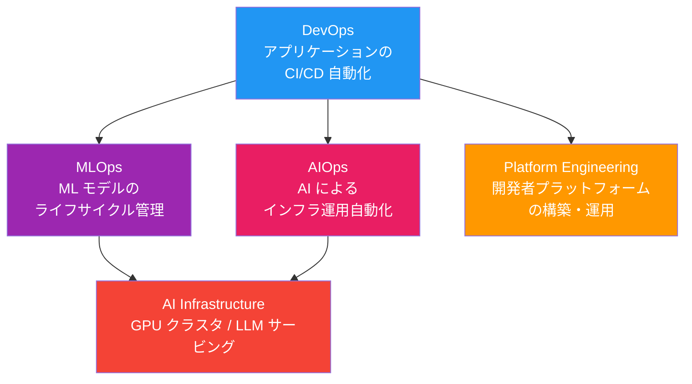
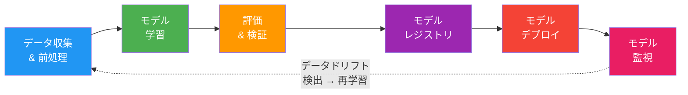
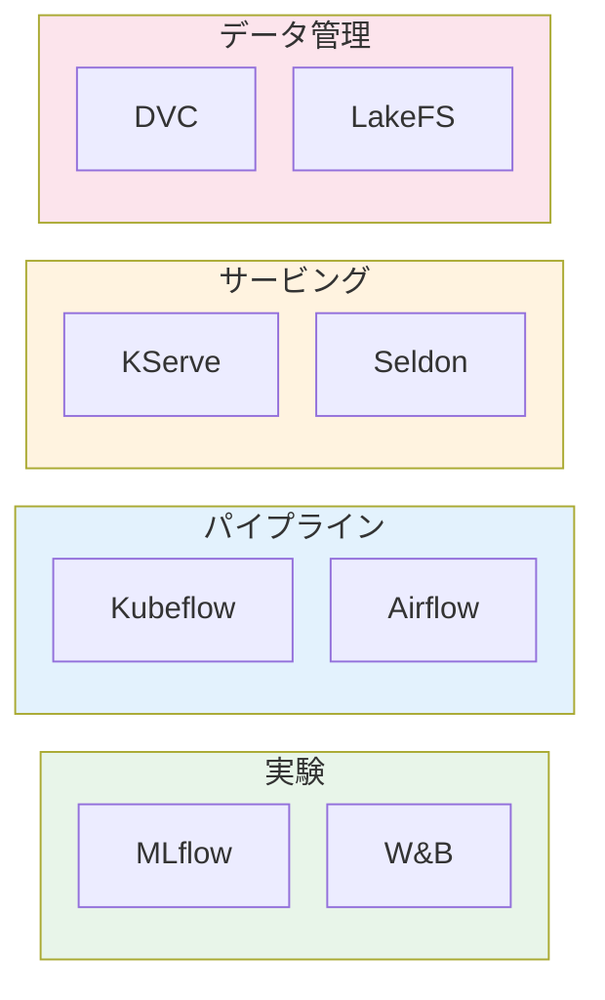
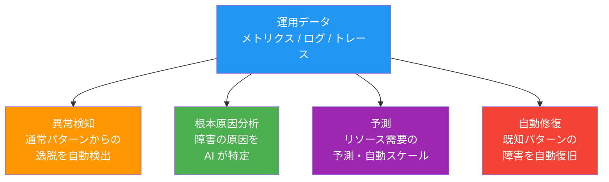
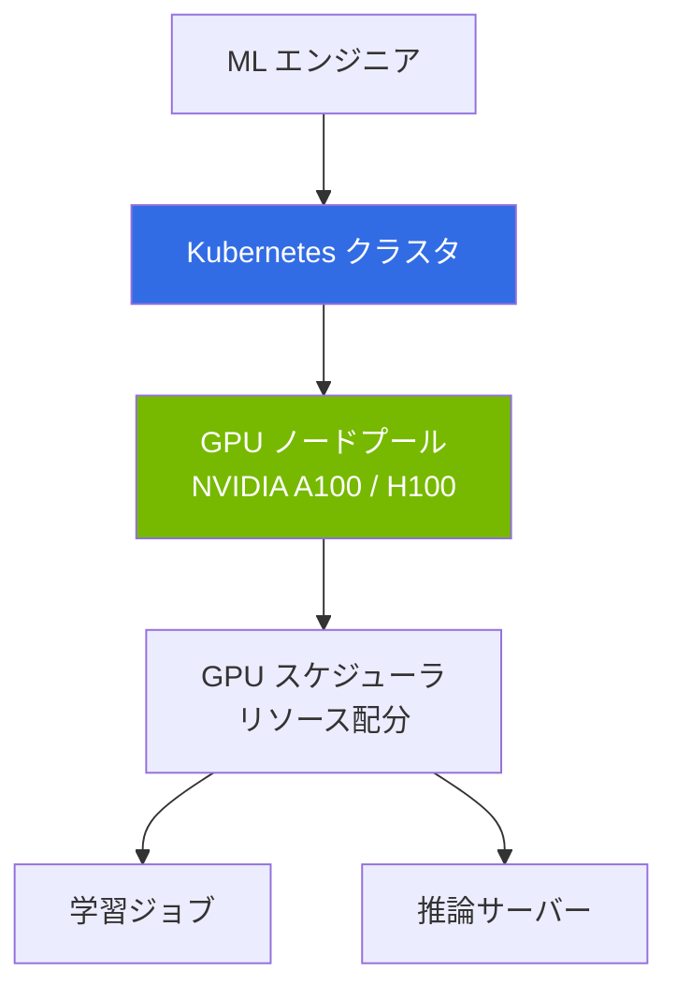
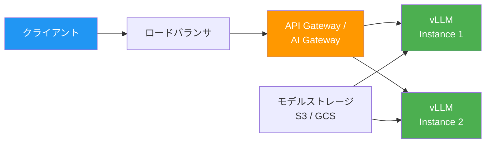
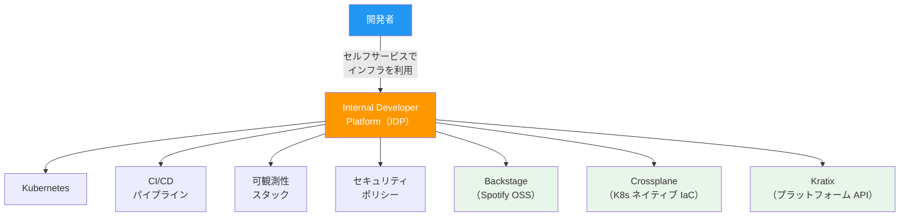
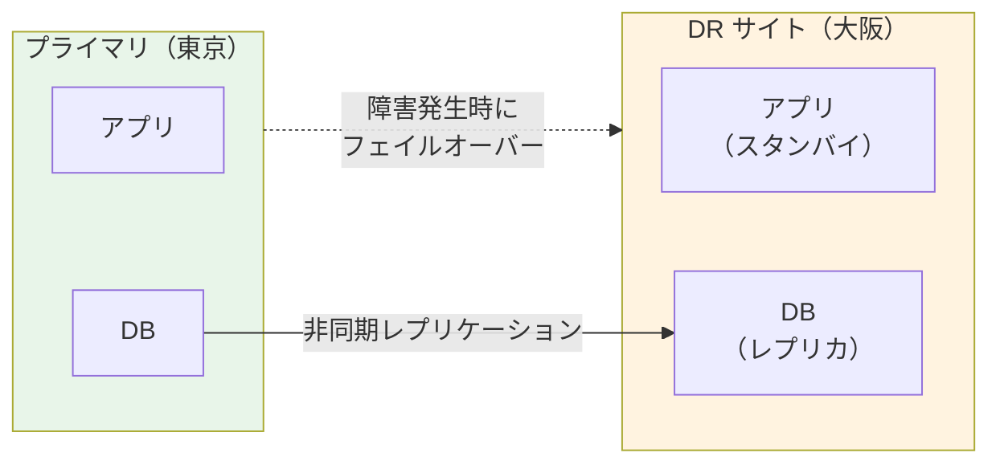
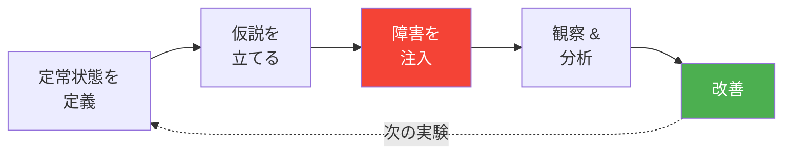
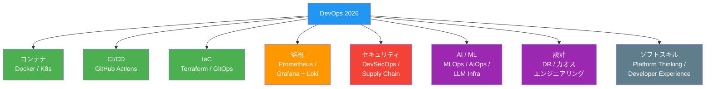

# 13. MLOps / AIOps — AI 時代のインフラ運用

> ⏱ 所要時間目安: 2〜3 時間（読み物 + 概念演習）
>
> **本章の構成**: 幅広いトピックを扱います。すべてを一度に覚える必要はありません。
> - **Track A**: MLOps の基本概念（データサイエンスに関心がある人向け）
> - **Track B**: システム設計・DR・カオスエンジニアリング（インフラに集中したい人向け）
> - 両方を学ぶのが理想ですが、興味のある Track から始めてください。

## この章で学ぶこと

- MLOps の概念と DevOps との関係
- ML パイプラインの構築
- モデルのバージョン管理とデプロイ
- AIOps によるインテリジェントな運用
- AI インフラストラクチャの基本（GPU / LLM サービング）
- Platform Engineering への進化

---

## DevOps → MLOps → AIOps の進化

| 領域 | 目的 | 代表的なスキル |
|------|------|-------------|
| **DevOps** | アプリの迅速な開発・デプロイ | CI/CD, IaC, K8s, GitOps |
| **MLOps** | ML モデルの実験→学習→デプロイ→監視 | ML パイプライン, モデルレジストリ |
| **AIOps** | AI で運用作業を自動化・最適化 | 異常検知, 予測スケーリング, 自動修復 |
| **Platform Engineering** | 開発者向けセルフサービスプラットフォーム | IDP, Backstage, ゴールデンパス |

---

## MLOps とは

### ML ライフサイクル

### DevOps と MLOps の比較

| 観点 | DevOps | MLOps |
|------|--------|-------|
| **バージョン管理** | コード | コード + データ + モデル |
| **テスト** | ユニット / 結合テスト | モデル精度 / データ品質テスト |
| **ビルド** | Docker イメージ | モデルアーティファクト |
| **デプロイ** | コンテナ → K8s | モデルサーバー → 推論エンドポイント |
| **監視** | レイテンシ / エラー率 | 精度劣化 / データドリフト |

### MLOps ツール

| カテゴリ | ツール | 概要 |
|---------|--------|------|
| **実験管理** | MLflow, W&B | パラメータ・メトリクス・モデルの追跡 |
| **パイプライン** | Kubeflow, Airflow | データ前処理→学習→デプロイの自動化 |
| **モデルサービング** | KServe, Seldon | K8s 上でモデルを推論APIとして公開 |
| **データ管理** | DVC, LakeFS | データセットのバージョン管理 |

---

## AIOps とは

AIOps は **AI/ML を使ってインフラ運用を自動化・最適化** する手法です。

### AIOps の活用例

| ユースケース | 説明 | ツール例 |
|------------|------|---------|
| **異常検知** | メトリクスの異常パターンを自動検出 | Prometheus + ML モデル |
| **ログ分析** | 大量のログからインシデントを自動分類 | Loki + LLM |
| **予測スケーリング** | トラフィック予測に基づく事前スケール | KEDA + カスタムメトリクス |
| **自動修復** | 既知障害パターンの自動対応 | Kubernetes Operator |
| **インシデント管理** | アラートの重複排除・優先度付け | PagerDuty / Opsgenie |

---

## AI インフラストラクチャ

2026 年、**AI / LLM のインフラ構築** は DevOps エンジニアの新たな重要スキルです。

### GPU クラスタの管理

### LLM サービングの構成

| 技術 | 概要 |
|------|------|
| **vLLM** | 高スループットの LLM 推論エンジン |
| **NVIDIA Triton** | マルチモデル推論サーバー |
| **KServe** | K8s ネイティブの ML モデルサービング |
| **Ray Serve** | 分散 ML サービングフレームワーク |

---

## Platform Engineering

DevOps の進化形が **Platform Engineering** です。

### Platform Engineering の目的

- 開発者が **インフラの詳細を知らなくても** アプリをデプロイできる
- **ゴールデンパス** を提供し、ベストプラクティスをデフォルトにする
- チケット駆動のインフラ申請を **セルフサービス** に変える

---

## システム設計とDR / カオスエンジニアリング

### システム設計の基本概念

DevOps エンジニアが知るべきシステム設計の要素：

| 概念 | 説明 |
|------|------|
| **可用性（Availability）** | 99.9% = 年間 8.76 時間のダウンタイム |
| **スケーラビリティ** | 水平スケール（Pod 追加） vs 垂直スケール（リソース増強） |
| **レジリエンス** | 障害が発生しても機能を維持する能力 |
| **冗長性** | マルチ AZ / マルチリージョンでの配置 |

### Disaster Recovery（DR）

| DR 戦略 | RTO | RPO | コスト |
|---------|-----|-----|-------|
| **Backup & Restore** | 数時間 | 数時間 | 低 |
| **Pilot Light** | 数十分 | 数分 | 中 |
| **Warm Standby** | 数分 | 秒単位 | 高 |
| **Multi-Site Active** | ゼロ | ゼロ | 最高 |

### カオスエンジニアリング

> 本番環境に **意図的に障害を注入** し、システムの回復力を検証する。

| ツール | 概要 |
|--------|------|
| **Chaos Mesh** | K8s ネイティブのカオスエンジニアリング |
| **Litmus** | CNCF プロジェクト、K8s 向けカオス実験 |
| **Gremlin** | エンタープライズ向けカオスプラットフォーム |

---

## 学習リソース

### 書籍

| 書籍 | 対象 |
|------|------|
| 『SRE サイトリライアビリティエンジニアリング』（Google） | SRE の教科書 |
| 『Designing Data-Intensive Applications』 | システム設計の名著 |
| 『Team Topologies』 | Platform Engineering の組織論 |

### 認定資格

| 資格 | 発行 | 内容 |
|------|------|------|
| **CKA** | CNCF | Kubernetes 管理者 |
| **CKS** | CNCF | Kubernetes セキュリティ |
| **HashiCorp Terraform Associate** | HashiCorp | Terraform の基礎 |
| **AWS Solutions Architect** | AWS | クラウドアーキテクチャ |
| **GitHub Actions Certification** | GitHub | CI/CD パイプライン |

### オンラインリソース

| リソース | URL | 内容 |
|---------|-----|------|
| **CNCF Landscape** | [https://landscape.cncf.io](https://landscape.cncf.io) | クラウドネイティブツールの全体マップ |
| **DevOps Roadmap** | [https://roadmap.sh/devops](https://roadmap.sh/devops) | インタラクティブな学習ロードマップ |
| **KillerCoda** | [https://killercoda.com](https://killercoda.com) | ブラウザで K8s ハンズオン |
| **Terraform Learn** | [https://developer.hashicorp.com/terraform](https://developer.hashicorp.com/terraform) | 公式チュートリアル |

---

## まとめ：2026 年の DevOps エンジニアに必要なもの

> **DevOps で止まるな。** MLOps、AIOps、AI インフラ — そこに仕事、報酬、そして未来がある。

---

## 演習問題

[exercises/](./exercises/) ディレクトリに演習があります。

---

## お疲れさまでした！

ここまで学んだあなたは、2026 年の DevOps エンジニアとして必要なスキルの全体像を把握しています。
あとは **実践あるのみ** です。手を動かし、壊し、直し、AI を使い倒して、最速で成長しましょう。
