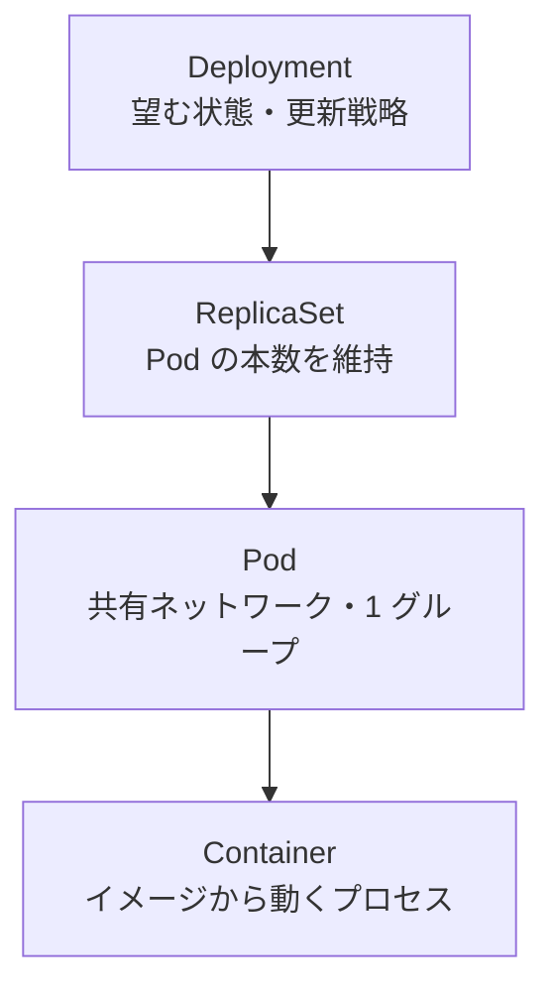

# Kubernetes: Deployment → ReplicaSet → Pod → Container

下図は、**ユーザーが主に触るオブジェクト（Deployment）から、実際に動くプロセス（Container）まで**の親子のつながりと、それぞれの役割の違いを示します。

## 読み方の補足

- **共通**: いずれも「望む状態を宣言し、コントロールプレーンと kubelet が現実に近づける」ためのオブジェクトの階層です。
- **差が出る階層**: 上ほど「アプリ全体の運用」（更新・ロールバック・本数の意図）、下ほど「実行の単位」（プロセス・ローカルな共有）に寄ります。
- **読み方**: **上から下**が「親が子を管理する」向きです。矢印は所有・管理関係の概略です。

1 つの Pod に **複数の Container** を入れることもあります（サイドカーなど）。その場合も「Pod がまとめ、Container が中で動く」という関係は同じです。

## 役割のひとこと比較

| リソース | 直接の子（典型） | 役割（初心者向け） |
| --- | --- | --- |
| **Deployment** | ReplicaSet | アプリの**版や更新**（ローリング更新・ロールバックなど）を扱う。ReplicaSet を通じて Pod を間接管理する。 |
| **ReplicaSet** | Pod | ラベルが合う Pod が**指定本数ある**ように保つ（複製の維持）。 |
| **Pod** | Container | **同じノード上**でネットワーク等を共有するコンテナのまとまり。スケールやデプロイの最小単位として扱われることが多い。 |
| **Container** | （なし） | **実際に動いているプロセス**（イメージから起動）。 |

**覚え方**: 日々 `kubectl` で触るのは多くの場合 **Deployment**（または直接 Pod）。**ReplicaSet** は Deployment が裏で作り、通常は直接いじらないことが多いです。
