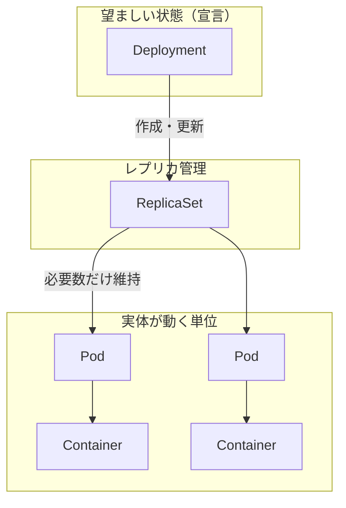

# Deployment / ReplicaSet / Pod / Container の関係

## 親子の階層（ざっくり）

- **Deployment** が **ReplicaSet** を束ね、ロールアウトやロールバックの単位になる。
- **ReplicaSet** が **Pod** の個数とラベル一致を維持する。
- **Pod** が **Container** をまとめ、同じノード上でネットワーク・ストレージを共有する。

## 役割の違い（短い表）

| リソース | 主な役割 | 親 | 子（典型） |
|----------|----------|-----|------------|
| **Deployment** | 望ましいアプリ状態の宣言、更新戦略、履歴 | （なし／クラスタ上のトップレベル宣言） | ReplicaSet |
| **ReplicaSet** | 指定ラベルの Pod を **一定数** に保つ | Deployment（通常は間接管理） | Pod |
| **Pod** | コンテナを **1 ノード** にまとめる最小スケジュール単位 | ReplicaSet など | Container |
| **Container** | 実際に動くプロセス（イメージ＋設定） | Pod | （なし） |

## よくある読み方

1. **ユーザーが触るのはほぼ Deployment**（`kubectl apply` の対象になりやすい）。
2. **ReplicaSet は Deployment が自動で作る**ことが多く、直接編集する必要は少ない。
3. **Pod は捨ててよい単位**（スケールや再配置で作り直される）。**Container は Pod の中で動く実体**。

---

*このメモは階層と責務の対比用。本番運用では Service・Volume・Probe など別リソースもセットで読む。*
