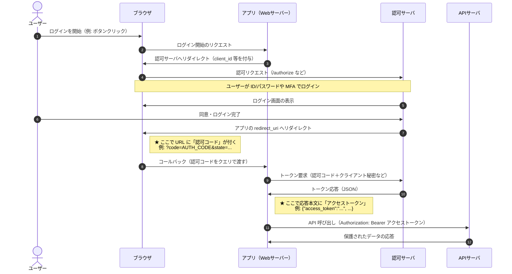

# OAuth のログインフロー（初心者向け）

OAuth（ここでは一般的な **認可コードフロー**）は、「パスワードを API サーバに渡さずに」「認可サーバが発行した **アクセストークン** だけで API を呼ぶ」ための流れです。次の 4 つが主な登場人物です。

| 役割 | ざっくりした仕事 |
|------|------------------|
| **ブラウザ** | ユーザーの操作画面。認可サーバのログイン画面を開き、リダイレクトで結果をアプリに返す。 |
| **アプリ** | あなたが作る Web アプリ（ここでは **サーバー側** がトークン交換まで担当する構成）。 |
| **認可サーバ** | ログインの受け付け、`認可コード` と `アクセストークン` を発行する。 |
| **API サーバ** | 実際のデータを返す。`アクセストークン` が正しければリクエストを処理する。 |

下図は、**左から右に時間が進む**シーケンス図です。矢印は「その相手へ HTTP などのやりとりが行く」ことを表します。**認可コード**は「ログイン成功後、ブラウザがアプリに戻る URL に載る短い使い捨ての合言葉」、**アクセストークン**は「API を呼ぶときに添える秘密に近い鍵」だとイメージしてください（実装では必ず HTTPS で送ります）。

## 読み方の補足

- **共通して通る道**: ユーザーは必ず **認可サーバ** で本人確認し、API サーバに直接パスワードを渡しません。
- **分かれ目（何がどこに出るか）**:
  - **認可コード**: ブラウザがアプリの URL に戻る **その瞬間**、アドレス欄のクエリ（`?code=...`）に現れます。寿命が短く、**フロントに見えてもすぐサーバーが使い捨てる**想定です。
  - **アクセストークン**: **ブラウザではなく**、アプリのサーバーと認可サーバの **バックチャネル（トークンエンドポイント）** の応答で渡されます。その後、API サーバへのリクエストの **Authorization ヘッダ** に載せます。
- **矢印の向き**: 上から下へステップが進み、横方向は「誰から誰へメッセージが行くか」です。

## 認可コードとアクセストークン（対比）

「どちらも認可サーバが関与するが、**見える場所**と**役割**が違う」ことを表にまとめます。

| | 認可コード（authorization code） | アクセストークン（access token） |
|---|----------------------------------|-------------------------------------|
| **主に現れる場所** | ブラウザ → アプリへのリダイレクト URL | トークン応答の JSON、以降の API リクエストのヘッダ |
| **だれが主に扱うか** | アプリのサーバーが一度受け取り、すぐ交換に使う | アプリが API 呼び出しに添える（公開クライアントでは扱い方に注意） |
| **イメージ** | 「トークンと交換するための一回券」 | 「API の窓口を開ける鍵」 |

ブラウザだけのアプリ（SPA）などでは **PKCE** を足して認可コードの盗難に備えることが多いですが、上図の「4 役者のやりとり」と「コード→トークン→API」の筋は同じです。
