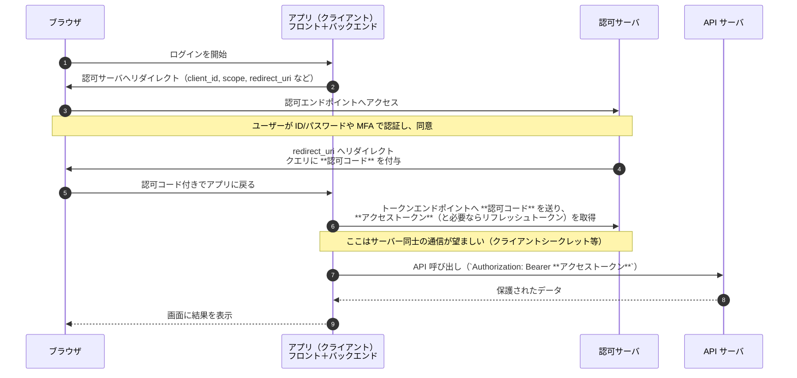
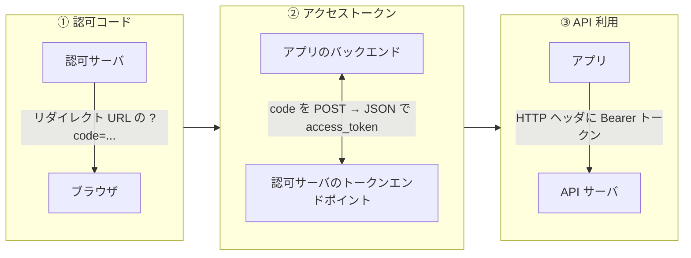

# OAuth のログインフロー（初心者向け）

この文書では、**認可コードフロー（Authorization Code Flow）** を例に、ユーザーのブラウザ・あなたのアプリ・**認可サーバ**（ログイン画面を出す側）・**API サーバ**（保護されたデータを返す側）がどうやりとりするかを整理します。

## 登場する用語（最小限）

| 用語 | ざっくり意味 |
|------|----------------|
| **認可サーバ** | ユーザー認証と「このアプリに権限を渡していいか」の同意を扱う。トークンを発行する。 |
| **クライアント（アプリ）** | ログインボタンを出し、リダイレクト先を受け取り、API を呼ぶアプリ本体。 |
| **API サーバ（リソースサーバ）** | `Authorization: Bearer ...` のアクセストークンでアクセスを許可する。 |
| **認可コード（authorization code）** | 一度きり・短時間で使う「引き換え券」。**ブラウザの URL に載って返る**ことが多い。 |
| **アクセストークン（access token）** | API を呼ぶときに添える秘密に近い値。**認可サーバがクライアントに直接渡す**（ブラウザに晒さない設計が推奨）。 |

## 全体の流れ（シーケンス図）

典型的な **バックエンド付き Web アプリ** の場合：認可コードの交換は **サーバー同士** で行い、アクセストークンをブラウザに渡さないパターンです。

## 認可コードとアクセストークンが「どこで」出るか

- **認可コード**：ユーザー操作のあと、**ブラウザ経由で** アプリに戻る URL に載る（例：`https://あなたのアプリ/callback?code=xxx&state=yyy`）。
- **アクセストークン**：**認可コードとクライアント情報を認可サーバに送ったレスポンス**でアプリが受け取る。以降、API サーバへのリクエストに付ける。

## ステップ一覧（図と対応）

1. アプリが認可 URL へ誘導する（まだコードもトークンもない）。
2. 認可サーバでログイン・同意。
3. **認可コード** が付いたリダイレクトでブラウザがアプリに戻る。
4. アプリ（主にバックエンド）が **認可コードをトークンに交換**し、**アクセストークン** を得る。
5. **アクセストークン** を付けて API サーバを呼ぶ。

## 補足（覚えておくとよいこと）

- **なぜコードを挟むのか**：ブラウザの履歴や Referrer に長寿命トークンが残りにくく、トークン取得をサーバー側に寄せられるためです（実装次第ではフロントのみの構成もありますが、初心者向けの説明では「バックエンドで交換」が分かりやすいです）。
- **state パラメータ**：CSRF 対策で、リダイレクトの往復で同じ値か検証します（図では省略していますが、本番では必須級です）。
- **OpenID Connect**：「ログイン」と「ユーザー情報（ID トークン）」を扱う拡張で、認可サーバは多くの場合 OIDC 対応の IdP です。フローの骨格は上記と同じです。

この README は **認可コードフロー** に絞った自己完結型の説明です。モバイルアプリや SPA だけの構成では、PKCE など追加の守り方がありますが、ブラウザ・認可サーバ・API の役割分担は同じ考え方で読み替えられます。
