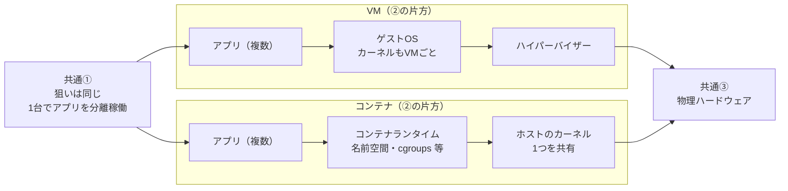
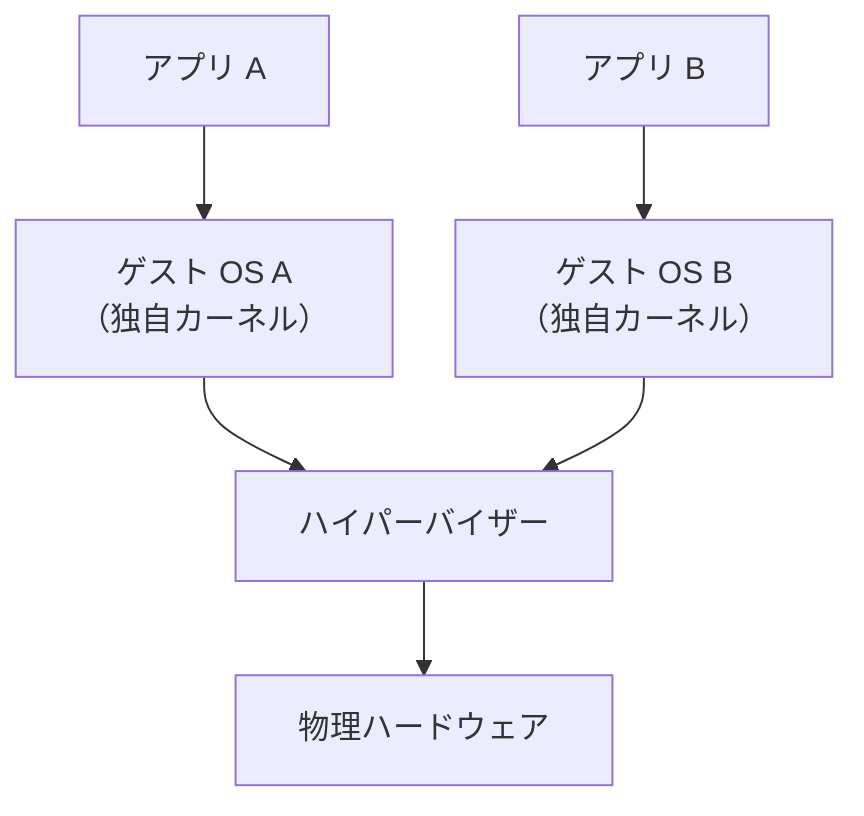
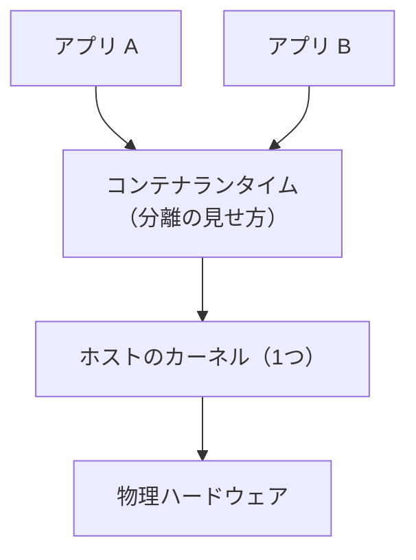

# README 差し替え案: 「コンテナ vs 仮想マシン（VM）」節

このブロックは `foundation/01-what-is-docker/README.md` の「### コンテナ vs 仮想マシン（VM）」から「分離レベルの違い」周りまでを置き換える想定の**自己完結した原稿**です（リポジトリ本体は変更していません）。

---

## この節の読み順（おすすめ）

1. **比較表**で「数値・感覚の差」（起動時間・サイズなど）を掴む。  
2. **図1（左右・LR）**で「共通の狙い → 分かれ目 → 最終的に同じハードウェア」の流れを見る。  
3. **図2・図3（それぞれ縦・TB）**で、VM とコンテナの**積み重ねだけ**を個別に確認する（サブグラフ同士の重なりを避けるため**2枚に分割**）。  
4. **共通点 / 差分の箇条書き**で頭の中を整理する。

---

### コンテナ vs 仮想マシン（VM）

| | コンテナ | 仮想マシン |
|---|---|---|
| 起動時間 | 秒単位 | 分単位 |
| サイズ | MB 単位 | GB 単位 |
| 分離レベル | プロセスと Linux 名前空間など（**カーネルは共有**） | ゲスト OS ごと（**カーネルも別**） |
| オーバーヘッド | 小さい | 大きい |

#### オーバーヘッドとは？

**オーバーヘッド**とは、「アプリを動かす」という本来の目的のほかに、仕組み側が余分に消費するコストのことです。たとえば **CPU・メモリ・ディスク容量** の追加消費、**起動にかかる時間**、**更新やパッチの対象になる OS の数** などが含まれます。VM はゲスト OS 全体を載せるためオーバーヘッドが大きく、コンテナはホストとカーネルを共有するため一般に小さくなります（ただし用途や設定によって変わります）。

#### 分離レベルの違い（図で比較）

下の**図1**は、**左から右**に読みます。左端「共通①」は両方式の**同じ狙い**、右端「共通③」は**どちらも最終的に物理ハードウェアで実行される**ことです。中央の左右は「同時に両方を積む」ではなく、**代表的な積み方の対比**です。

**分かれ目（②）**は一言でいうと、**カーネルを「VM ごとに増やす」か「コンテナ全体で1つ共有する」か**です。

**図2・図3**は、図1の左右それぞれを**縦方向だけ**に抜き出したものです（並列サブグラフを1枚の縦フローに詰め込まず、**タイトル帯とノードの重なり**を避けます）。

**VM 側の積み重ね（上→下）**

**コンテナ側の積み重ね（上→下）**

**共通点（先に押さえる）**

- **目的**: 1 台のマシン上でアプリ同士を**分離したまま**動かす（図1 の「共通①」）。  
- **最終実行場所**: どちらも命令は**物理ハードウェア**上で動く（図1 の「共通③」）。  
- **ユーザー視点の価値**: 「環境をまとめて持ち運び、別マシンでも同じように動かす」という発想に近い。

**差分（ここから先が違う）**

| 観点 | VM | コンテナ |
|---|---|---|
| **カーネル** | ゲスト OS ごとに**別カーネル** | **ホストと1つのカーネルを共有** |
| **分離の主な境界** | 「別マシンに近い」強い分離（ゲスト OS 単位） | 名前空間・cgroups 等（**カーネルは共有**） |
| **典型トレードオフ** | 重い・大きいが分離は強め | 軽い・小さいが脅威モデルや要件次第で選定が変わる |

まとめると、コンテナは VM より **軽く・速く・イメージも小さくなりやすい**です。その代わり、分離の設計（カーネル共有）が VM と異なるため、脅威モデルやコンプライアンスの要件に応じて使い分けます。

---

## 親エージェント向けメモ

- 元 README の `flowchart TB` 内**左右並列サブグラフ**は、レンダラによってタイトル帯とノードが**重なりやすい**ため、**図1 を `flowchart LR`、詳細を図2・図3 の `flowchart TB` に分割**する形に変更しています。  
- 図1 では「共通①」から **VM・コンテナ両方のアプリ層**へ矢印を引き、**誤読（片方だけが狙いの対象）**を避けています。
