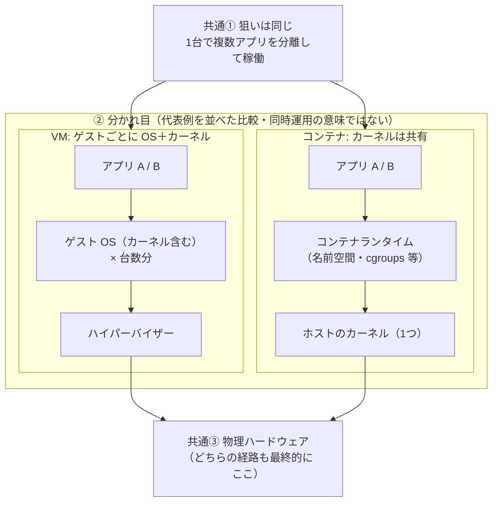
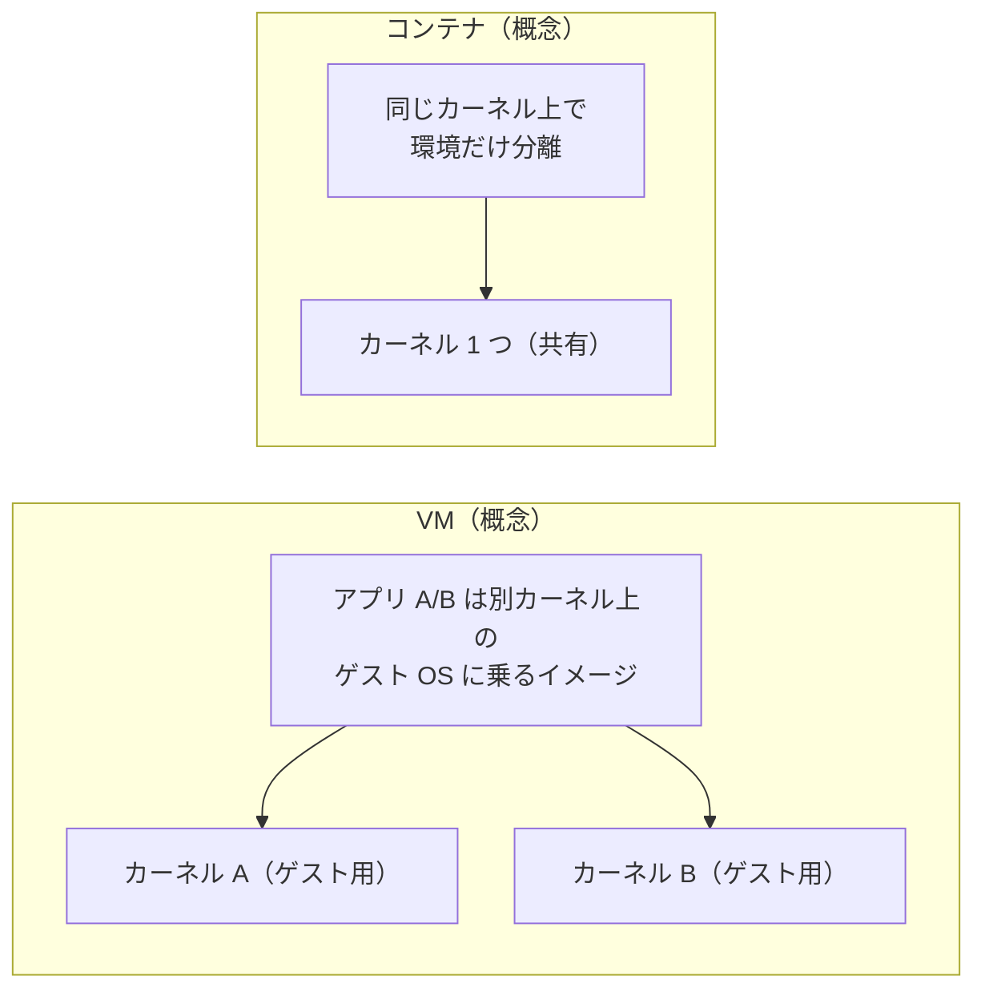

# コンテナと仮想マシン（VM）— 共通点と差分

## 一目で比較

| 観点 | 共通 | VM 側 | コンテナ側 |
|------|------|--------|------------|
| **狙い** | 1 台のマシン上でアプリ同士を分離して動かす | ゲスト OS ごとに「別マシンに近い」強い分離 | カーネルは 1 つ共有し、名前空間等で見え方を分ける |
| **最終実行** | どちらも命令は物理ハードウェアで実行される | ハイパーバイザー経由で HW へ | 共有カーネル経由で HW へ |
| **典型コスト** | （比較の軸） | 起動・容量・OS パッチ対象が重め | 軽量・高速になりやすい（要件次第） |

**一文で差分:** VM は **カーネルも含めた OS を VM ごとに積む**。コンテナは **ホストのカーネル 1 つを共有**し、その上でランタイムがプロセス環境を分ける。

---

## 図 1: 共通点（上）→ 分かれ目（左右）→ ハードウェア（下）

矢印は **データの流れというより「どこに何が積まれるか」** の積み重ねです。`goal` から左右へ広がる線は 1 本ずつにして、ノードの重なりを避けています。

**読み方:** 上の「共通①」から左右に分岐し、**左はカーネルが複数（VM ごと）**、**右はカーネルが 1 つ**と見比べる。下の「共通③」で両方とも同じ HW に行き着く。

---

## 図 2: 「カーネルがいくつあるか」だけ抜き出し

対比だけ見たいとき用。左右は同じランクに並べ、線の交差を減らしています。

---

## 補足（短く）

- **オーバーヘッド:** VM はゲスト OS 全体ぶん、CPU・メモリ・ディスク・起動時間・パッチ対象が増えやすい。コンテナはカーネル共有のため一般に小さくなりやすい（設定次第）。
- **使い分け:** 強い分離や「別 OS カーネルが必要」に VM、開発・デプロイの速さと密度にコンテナ、という整理がよく使われる。要件（セキュリティ・コンプライアンス）で最適解は変わる。
