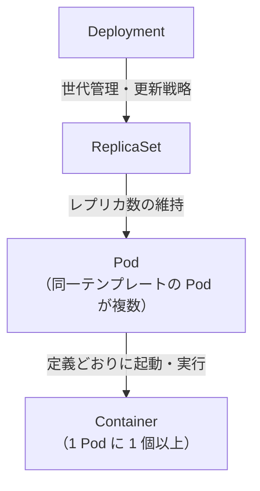

# Deployment / ReplicaSet / Pod / Container の関係

下図は、**望ましい状態（レプリカ数・更新）から、実際に動くプロセス（コンテナ）まで**の親子関係を上から下に示します。

**読み方の要点**

- **共通**: いずれもマニフェストで「望ましい状態」を宣言し、コントローラが実態へ近づける。
- **差が出る階層**: Deployment は**デプロイ運用**、ReplicaSet は**Pod 個数の一致**、Pod は**同一ノード上のまとまりと共有**、Container は**実プロセス**。
- **矢印の向き**: 上から下へ「管理・生成の主体 → 対象」。

## 役割の違い（短表）

| リソース | 親（典型的な管理元） | 役割（一言） |
| --- | --- | --- |
| **Deployment** | （ユーザーが直接宣言） | 望ましいレプリカ数と**更新方法**（Rolling 等）を握り、**ReplicaSet を世代管理**する。 |
| **ReplicaSet** | Deployment（または単体宣言） | Pod テンプレートに**一致する Pod が N 個**になるよう作成・削除する。 |
| **Pod** | ReplicaSet | **スケジュール単位**。同一ノード上でコンテナを束ね、ネットワーク・ストレージ等を共有しうる。 |
| **Container** | Pod の spec | **実行単位**。イメージに基づきプロセスを動かす（Init コンテナは起動順の補助）。 |

**補足**: ローリング更新では Deployment が**新しい ReplicaSet を追加**しつつ古い ReplicaSet の Pod を減らすため、短時間だけ ReplicaSet が複数世代存在することがある。図は「論理上の親子」と「1 Pod 内に複数コンテナがありうる」ことにフォーカスしている。
