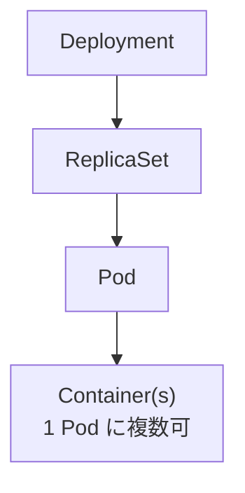

# Deployment / ReplicaSet / Pod / Container の関係（図と短い表）

下図は、**ワークロードを宣言から実行までつなぐ所有関係（だいたいの親子）**を上から下に示します。ローリングアップデート中は Deployment が一時的に **新しい ReplicaSet と古い ReplicaSet の両方**を持つことがありますが、平常時は「1 本の鎖」で読めます。

**読み方の要点**

- **共通**: いずれも「望ましい状態」を宣言し、下位がそれを満たすよう具体物（Pod・プロセス）を作る。
- **分かれ目**: **Deployment** は更新戦略や履歴まで面倒を見る。**ReplicaSet** は「個数合わせ」に特化。**Pod** はスケジュールと共有リソースの境界。**Container** が実際の実行体。
- **矢印**: 上が下を**所有・管理**する向き（例外や一時的な二重 RS は本文注記のとおり）。

| 対象 | 直接の親（典型） | 役割（違いの芯） |
| --- | --- | --- |
| **Deployment** | （この説明では最上位） | 望ましいレプリカ数・イメージなどを宣言し、**ロールアウト/ロールバック**で ReplicaSet を段階的に切り替える |
| **ReplicaSet** | Deployment | **指定個数の Pod** が動いている状態を維持する（スケールの「数」の守り手） |
| **Pod** | ReplicaSet | 同一ノード上の**最小デプロイ単位**。IP やボリュームなどをコンテナ間で共有しうる |
| **Container** | Pod 内の定義 | **実際に動くプロセス**。イメージから起動し、CPU/メモリ制限などの単位にもなる |
