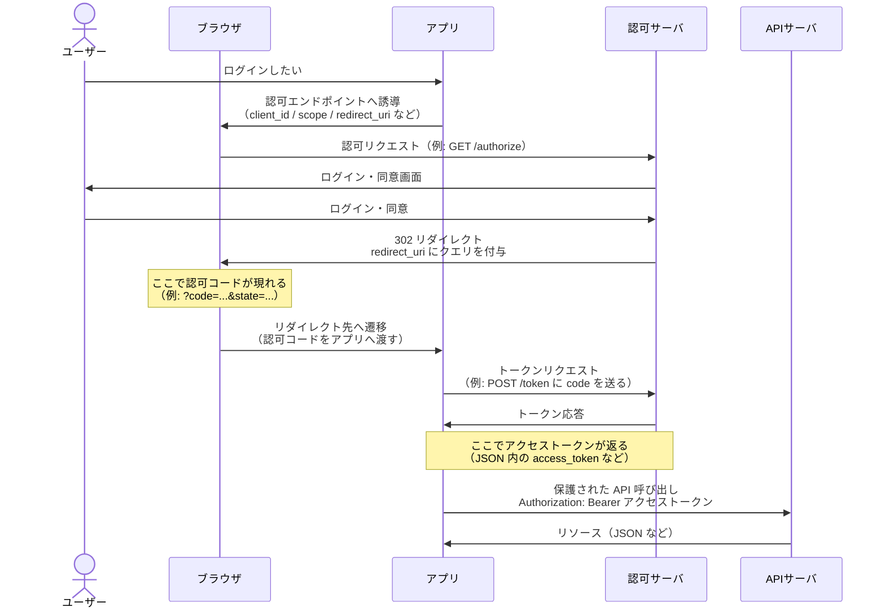

# OAuth のログインフロー（初心者向け・README 用メモ）

この節のゴールは、**ブラウザ・アプリ・認可サーバ・API サーバがどの順で話し合い、どこで「認可コード」と「アクセストークン」が現れるか**を一枚の流れとして追えることです。ここでは代表的な **認可コードフロー**（Web アプリやネイティブアプリでよく使う形）を前提にします。

## 4 つの役割（ざっくり）

| 役割 | 役割の一言 |
|------|------------|
| **ブラウザ** | ユーザーの操作画面。認可サーバのログイン画面を開き、リダイレクトで結果をアプリに返す「運び屋」。 |
| **アプリ** | 「ログインして」とユーザーに頼み、受け取ったコードをトークンに交換し、API を呼ぶ本体。 |
| **認可サーバ** | 本人確認をし、**認可コード**や**アクセストークン**を発行する窓口。 |
| **API サーバ** | **アクセストークン**が妥当ならデータを返す、いわゆるバックエンド API。 |

## 全体のやりとり（Mermaid シーケンス）

下図は、**左から右へ時間が進む**シーケンス図です。矢印は「メッセージの送り先」、注釈は**認可コード**と**アクセストークン**が現れる場所を示します。

### 読み方の補足

- **共通して起きること**: 認可サーバが「このユーザーは OK」と判断したあと、まず短命の **認可コード**をブラウザ経由でアプリに渡し、続けてアプリが認可サーバにそのコードを見せて **アクセストークン**に交換します。
- **分かれ目**: **認可コード**は主に **ブラウザの URL（リダイレクト）**に載ります。**アクセストークン**は通常 **アプリと認可サーバの直接通信**（トークンエンドポイントの応答）で受け取り、以降 API サーバへのリクエストに添えます。
- **矢印の意味**: `->>` は要求や応答のやりとりを表します。実装では HTTPS の GET/POST、ヘッダやフォームの形になります。

## 認可コードとアクセストークンだけ抜き出し

| 項目 | 主な出現場所 | 役割のイメージ |
|------|----------------|----------------|
| **認可コード** | ブラウザ → アプリへのリダイレクト URL のクエリ（例: `code=`） | 「本人確認と同意が終わったよ」の**一回限りの引換券**。そのまま長期保存しないのが望ましい。 |
| **アクセストークン** | 認可サーバ → アプリのトークン応答（JSON など） | API サーバに「このユーザーとしてアクセスしていい」ことを示す**パス**。 |

## 補足（README に一行足すなら）

- 本稿は **OAuth 2.0 の認可コードフロー**の概略です。公開クライアント（SPA・モバイルアプリ等）では **PKCE** を組み合わせることが一般的です（図の形は同じで、トークンリクエストに追加パラメータが乗ります）。
- **OpenID Connect** を使うと、同じ流れのなかで **ID トークン**（ログインしたユーザーの識別情報）も返り、いわゆる「ログイン」と一体化します。
