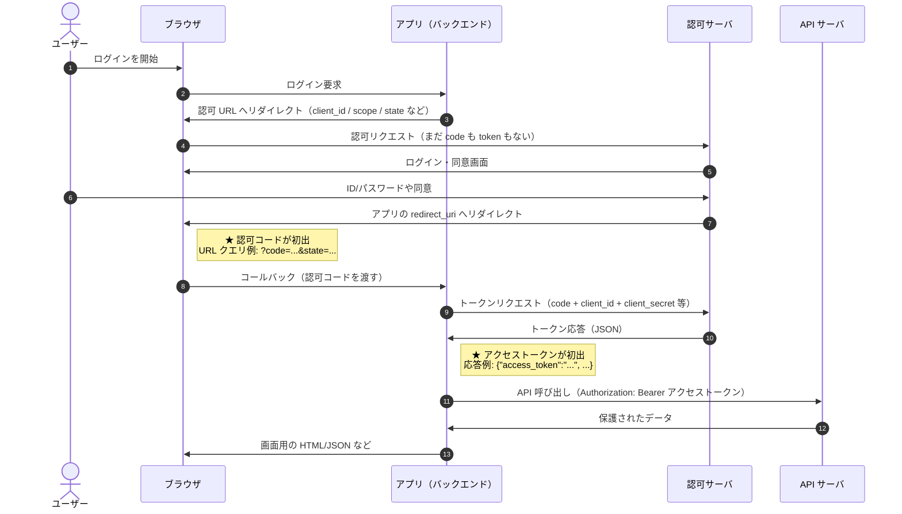
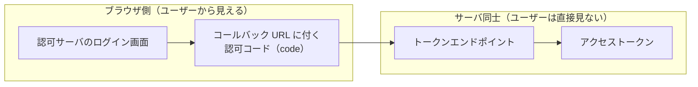

# OAuth のログインフロー（初心者向け）

OAuth 2.0 の **認可コードフロー**は、**API サーバにユーザーのパスワードを渡さず**、認可サーバが発行した許可に基づいて **アクセストークン** だけで API を呼ぶための流れです。ここでは **ブラウザ**・**アプリ（バックエンド）**・**認可サーバ**・**API サーバ**のやりとりを順に追い、**認可コード**と**アクセストークン**がどこで初めて現れるかを図に示します。

---

## 登場する役割

| 役割 | ざっくりした仕事 |
|------|------------------|
| **ブラウザ** | ユーザーの操作画面。認可サーバのログイン画面を開き、リダイレクトで結果をアプリに返す。 |
| **アプリ（バックエンド）** | 自社の Web サーバ。認可 URL を組み立て、**認可コードをアクセストークンに交換**し、API を呼ぶ。 |
| **認可サーバ** | IdP / 認可エンドポイント。ログインと同意の UI を出し、**認可コード**と**アクセストークン**を発行する。 |
| **API サーバ** | 保護したいリソース。**アクセストークン**が妥当か確認してからデータを返す。 |

---

## 全体の流れ（シーケンス図）

下図は、**認可コード**がブラウザ経由でアプリに届く場面と、**アクセストークン**が認可サーバからアプリに直接返る場面を区別して示しています。矢印は「そのタイミングで HTTP などのやりとりがある」という意味です。実運用では **HTTPS** を前提にします。

### 読み方の補足

- **共通の狙い**: ユーザーは **認可サーバ** で本人確認し、API サーバにログイン用パスワードを直接渡さない。
- **分かれ目**: **認可コード**は主に**ブラウザ経由**（コールバック URL）でアプリに届く。**アクセストークン**は **アプリと認可サーバのバックチャネル**（トークンエンドポイントの応答）で渡るのが典型（機密クライアント＋バックエンド構成）。
- **上から下**: 番号付きの順に時間が進みます。

---

## 認可コードとアクセストークン（対比表）

「どちらも認可サーバが関与するが、**現れる場所**と**役割**が違う」ことを表にまとめます。

| | 認可コード（authorization code） | アクセストークン（access token） |
|---|----------------------------------|-------------------------------------|
| **主に現れる場所** | ブラウザ → アプリへのリダイレクト URL（`?code=...`） | トークン応答の JSON、以降の API リクエストの `Authorization` ヘッダ |
| **だれが主に扱うか** | アプリのサーバが受け取り、すぐトークン交換に使う | アプリが API 呼び出しに添える（公開クライアントでは扱い方に注意） |
| **イメージ** | トークンと交換するための **一回限りの合言葉** | API の窓口を開ける **鍵**（漏れると被害が大きい） |

---

## 認可コードとアクセストークンだけ抜き出す図（LR）

「どの区間に何が載るか」を一枚で整理した図です。比較の軸は **ブラウザの URL / 画面に出る情報** と **サーバ同士だけのやりとり** です。

---

## 覚えておくとよいポイント（超要約）

1. **認可コード** … 寿命が短く、**そのままでは API を呼べない**。主に **リダイレクト URL** 経由でアプリに届く。
2. **アクセストークン** … **API サーバがリクエストを許可する**ために使う。典型では **トークン応答**でアプリが受け取る。
3. **state** … 図の認可 URL に含めています。実装では **CSRF 対策**として、セッション等と突き合わせて一致を確認することが多いです。
4. **公開クライアント**（ネイティブアプリやブラウザだけの SPA など）では **PKCE** を追加して、認可コードの取りこぼしを想定した攻撃に備える構成が一般的です。本 README の図は学習用に **機密クライアント＋バックエンド** 寄りの王道フローを描いています。

---

## 正確性について

実装やプロバイダにより、トークンの形式（不透明トークン / JWT）、API サーバがトークンを検証する方法（JWT 署名検証、イントロスペクション、認可サーバとの連携など）は異なります。上記は **概念図**としての OAuth 2.0 認可コードフローの整理です。
