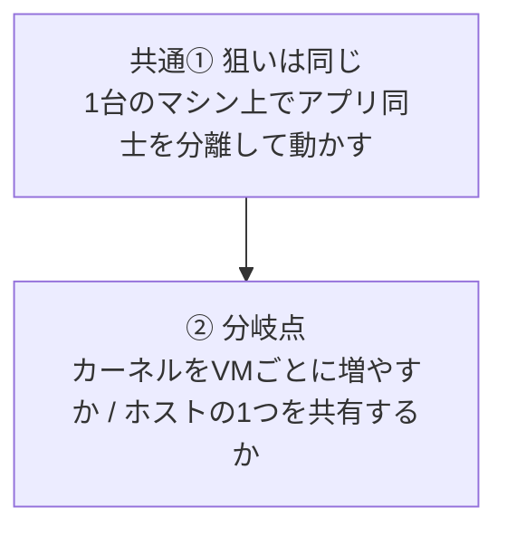
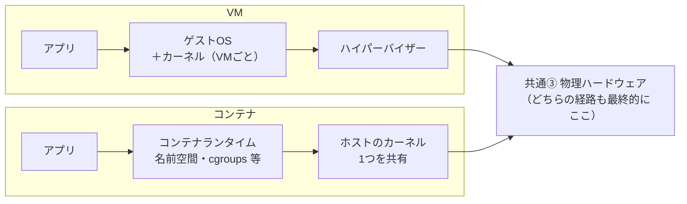

### コンテナ vs 仮想マシン（VM）

| | コンテナ | 仮想マシン |
|---|---|---|
| 起動時間 | 秒単位 | 分単位 |
| サイズ | MB 単位 | GB 単位 |
| 分離レベル | プロセスと Linux 名前空間など（カーネルは共有） | ゲスト OS ごと（カーネルも別） |
| オーバーヘッド | 小さい | 大きい |

#### オーバーヘッドとは？

**オーバーヘッド**とは、「アプリを動かす」という本来の目的のほかに、仕組み側が余分に消費するコストのことです。たとえば **CPU・メモリ・ディスク容量** の追加消費、**起動にかかる時間**、**更新やパッチの対象になる OS の数** などが含まれます。VM はゲスト OS 全体を載せるためオーバーヘッドが大きく、コンテナはホストとカーネルを共有するため一般に小さくなります（ただし用途や設定によって変わります）。

#### 分離レベルの違い（図で比較）

下の2枚は、**共通点（入口と出口）**と**分岐点**を先に示し、続けて **VM とコンテナの積み上げを左右で同じ段の高さに揃えて**比較します。左右は「同時に両方を必ず使う」という意味ではなく、**代表的な積み方の対比**です（実運用ではどちらか、または混在構成を選びます）。

**図1（上→下）**: 共通①から分岐点②へ。

**図2（左→右＋各列は上→下）**: ②の先の積み上げと、共通③（物理ハードウェア）まで。

**読み方の要点**

- **共通**: ①のとおり狙いは「分離して動かす」こと。③のとおり、最終的な実行はどちらも物理ハードウェアに行き着きます。
- **差分**: ②以降。VM は **ゲスト OS とカーネルが VM 単位で増え**、その下にハイパーバイザーがあります。コンテナは **カーネルは 1 つ**を共有し、ランタイムが名前空間などで見え方を分けます。
- **視線の動かし方**: 図1は上から下。図2は列ごとに上から下（アプリ → 分離の仕組み → インフラ寄りの層）と読み、**同じ段を横に比較**してください。

表の「起動・サイズ・オーバーヘッド」の差は、大づかみには **②以降でカーネルやゲスト OS をどれだけ複製するか**の違いとして説明できます。

まとめると、コンテナは VM より **軽く・速く・イメージも小さくなりやすい**です。その代わり、分離の設計（カーネル共有）が VM と異なるため、脅威モデルやコンプライアンスの要件に応じて使い分けます。
