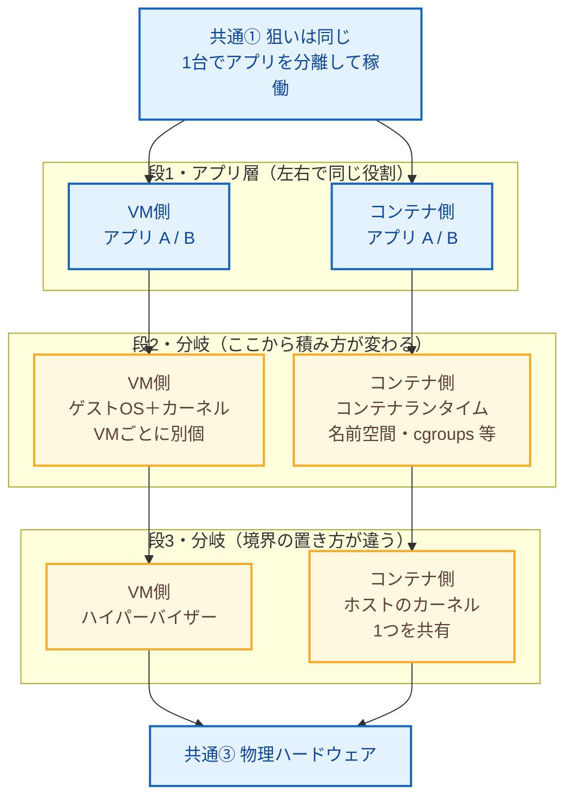

# VM とコンテナ：横並びレイヤ比較（1枚）

`foundation/01-what-is-docker/README.md` の「分離レベルの違い」を、**1枚の図**で読み取れるようにしました。各段は **左＝VM / 右＝コンテナ**で、**同じ段のノードが常に同じ高さ**に並ぶように構成しています（行＝レイヤ）。

## 段と列の対応

| 段 | 左（VM） | 右（コンテナ） |
|---|---|---|
| 1 | アプリが載る | アプリが載る（役割は同じ） |
| 2 | **ゲスト OS＋カーネル**（VM ごと） | **ランタイム＋名前空間等**（カーネルはまだ共有） |
| 3 | **ハイパーバイザー** | **ホストのカーネル 1 つ**（全コンテナで共有） |
| 4 | 物理ハードウェアへ | 物理ハードウェアへ（共通の出口） |

## 読み方

- **横に見る**: 各 `段n` の行で **左と右を同じ高さの対応ペア**として読む（段1は両方アプリ、段2・3が本丸の差分）。
- **縦に見る**: 左列だけ、右列だけをたどると、それぞれ VM / コンテナの積み上げ順になる。
- **共通と差分**: 狙い・アプリ層・物理 HW は共通の土台。段2・3で「カーネルを VM ごと持つか、1つ共有するか」と「その下にハイパーバイザーか共有カーネルか」が分かれる。

※ 代表モデルです。Type-1/2 ハイパーバイザーやホスト OS の扱いなど、実装で細部は異なります。
